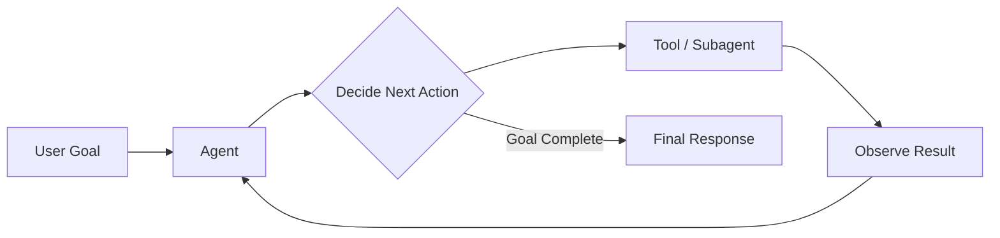
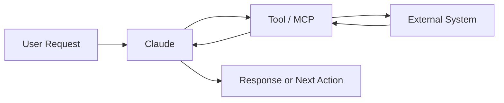
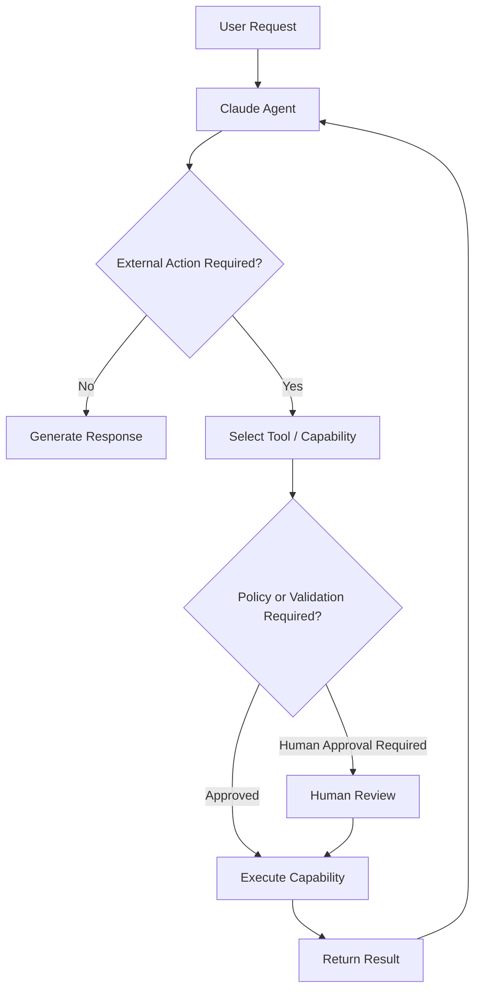

# Claude Agentic AI Architecture

A structured technical reference covering **Claude, agentic workflows, tool use, Model Context Protocol (MCP), Claude Code, and related architecture patterns**.

This repository is being developed alongside my preparation for the **Claude Certified Architect – Foundations** certification. The objective is to consolidate key concepts into concise, reusable documentation that supports both **certification revision** and **practical architecture understanding**.

The repository will continue to evolve as additional certification domains are completed.

---

## Current Coverage

| Domain                 | Focus Area                           | Status        |
| ---------------------- | ------------------------------------ | ------------- |
| **Domain 1**           | Agentic Architecture & Orchestration | ✅ Completed   |
| **Domain 2**           | Tools, MCP & Claude Code             | ✅ Completed   |
| **Domain 3** | Claude Code Configuration, Memory & Workflows | ✅ Completed |
| **Additional Domains** | To be added progressively            | ⏳ In Progress |

---

## Domain 1 — Agentic Architecture & Orchestration

This domain covers the architectural foundations of agentic systems and how Claude can operate beyond a traditional request-response interaction.

### Topics Covered

* Chatbot vs Agent
* Agentic Loop
* Tool-Use Lifecycle
* `stop_reason`
* `tool_use` and `tool_result`
* Coordinator and Subagent Patterns
* Task Decomposition
* Delegation and Aggregation
* Context Passing
* Prompt Chaining
* Dynamic Decomposition
* Guidance vs Enforcement
* Agent Hooks
* `PreToolUse` and `PostToolUse`
* Human-in-the-Loop
* Human Handoff
* Sessions and Forking

### Architecture Overview



The core principle is that an agent can **evaluate, act, observe, and iterate** until it reaches an appropriate completion point.

➡️ **[View Domain 1 Notes](docs/01-domain-1-agentic-workflows/README.md)**

---

## Domain 2 — Tools, MCP & Claude Code

This domain focuses on how Claude interacts with external systems, applications, data sources, files, APIs, and development environments.

### Topics Covered

* Tool Architecture
* Client Tools and Server Tools
* Tool Definitions
* Tool Descriptions
* Input Schemas
* Tool Naming and Ambiguity
* Tool Distribution
* `tool_choice`
* Structured Error Handling
* Retryable vs Non-Retryable Errors
* Success with Empty Results
* Model Context Protocol (MCP)
* MCP Tools and Resources
* MCP Server Architecture
* Local and Remote MCP Connections
* Configuration Scopes
* Secret Handling
* Claude Code Built-in Tools
* Read / Write / Edit / Bash
* Grep vs Glob

### Architecture Overview



The central architecture principle is that tools provide Claude with **controlled access to external capabilities**, while MCP provides a standardized integration model for exposing tools and context.

➡️ **[View Domain 2 Notes](docs/02-domain-2-tools-mcp-and-claude-code/README.md)**

---

## Key Architecture Concepts

| Concept                   | Architecture Perspective                                              |
| ------------------------- | --------------------------------------------------------------------- |
| **Agent**                 | Iteratively evaluates, acts, observes, and continues toward a goal    |
| **Coordinator**           | Decomposes work, delegates tasks, and aggregates results              |
| **Subagent**              | Provides specialized execution within an isolated responsibility      |
| **Prompt Chaining**       | Suitable for predictable, predefined workflows                        |
| **Dynamic Decomposition** | Suitable when subsequent actions depend on runtime discoveries        |
| **Tool**                  | Provides an external capability that Claude can request               |
| **Tool Definition**       | Describes the capability, usage conditions, and expected input        |
| **MCP**                   | Standardizes integration between AI applications and external systems |
| **Resource**              | Provides contextual information without representing an action        |
| **Hook / Policy Gate**    | Introduces deterministic control into an agent workflow               |
| **Human-in-the-Loop**     | Provides oversight for high-impact or sensitive actions               |

---
## Domain 3 — Claude Code Configuration, Memory & Workflows

This domain covers how Claude Code maintains persistent project context, applies scoped instructions, packages reusable workflows, plans complex changes, and operates safely in automated environments.

### Topics Covered

- `CLAUDE.md` and persistent project instructions
- User, project, local, and nested instruction scopes
- CLAUDE.md imports
- `.claude/rules/`
- Path-specific rules
- Skills and reusable workflows
- Skill frontmatter
- `$ARGUMENTS`
- `disable-model-invocation`
- `allowed-tools`
- `context: fork`
- Plan Mode
- Iterative refinement
- Sequential vs parallel execution
- Claude Code in CI/CD
- Structured output
- Turn, tool, and budget controls

➡️ **[View Domain 3 Notes](docs/03-domain-3-claude-code-configuration-memory-workflows/)**

## Agentic Architecture — Combined View

The concepts across Domains 1 and 2 can be represented through the following simplified workflow:



This architecture combines:

* iterative agent execution
* tool selection
* workflow control
* deterministic policy enforcement
* human approval
* external system interaction
* structured result handling

---

## Documentation Approach

Each domain is documented using a consistent structure:

```text
Concept
   ↓
Architecture Explanation
   ↓
Execution Flow
   ↓
Practical Example
   ↓
Comparison / Design Consideration
   ↓
Quick Revision
```

This format is intended to make the repository useful both as a **technical reference** and as a **rapid revision resource**.

---

## Repository Structure

```text
claude-agentic-ai-architecture/
│
├── README.md
│
└── docs/
    ├── 01-domain-1-agentic-workflows/
    │   └── README.md
    │
    ├── 02-domain-2-tools-mcp-and-claude-code/
    │   └── README.md
    │
    └── 03-domain-3-claude-code-configuration-memory-workflows/
        └── README.md
```

Additional domains will be incorporated as the certification preparation progresses.

---

## Purpose

The objective of this repository is to build a reusable understanding of Claude and agentic AI architecture by focusing on:

* architecture fundamentals
* execution and orchestration patterns
* tool and integration design
* workflow control
* reliability and error handling
* security and governance considerations
* practical implementation scenarios

The emphasis is on understanding **how the architecture works and why a particular design pattern should be used**, rather than memorizing terminology in isolation.

---

## Disclaimer

This repository contains independently prepared technical notes developed for learning, certification preparation, and architecture reference.

It is not official Anthropic documentation. Product behaviour, APIs, and implementation details should be validated against the latest official Anthropic documentation before production use.
