# Domain 1 — Agentic Architecture & Orchestration

Domain 1 focuses on how an AI system progresses from a simple **request-response interaction** to an **agentic workflow** capable of reasoning, taking actions, observing results, delegating work, and repeating until the task reaches an appropriate stopping point.

---

# 1. Chatbot vs Agent

The easiest way to understand an agent is to first compare it with a traditional chatbot.

| Chatbot                     | Agent                                   |
| --------------------------- | --------------------------------------- |
| Receives a request          | Receives a goal                         |
| Generates an answer         | Determines actions required             |
| Usually request → response  | Can perform multiple steps              |
| Primarily conversational    | Can interact with external tools        |
| Often stops after answering | Can continue until the task is complete |

### Chatbot

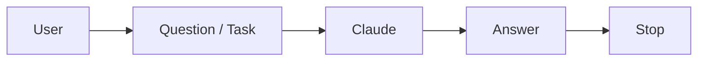

### Agent

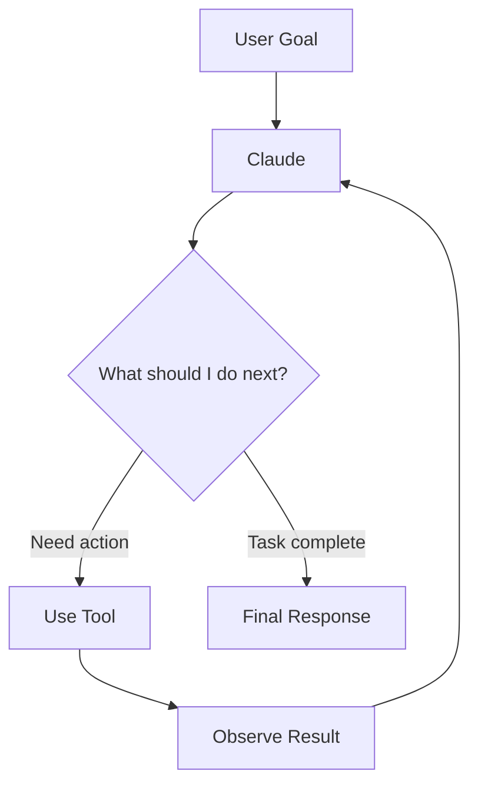

### Simple mental model

```text
Chatbot

Ask → Answer → Stop


Agent

Ask → Decide → Act → Observe → Decide Again → Finish
```

> **Revision Point:**
> A chatbot primarily responds.
> An agent can repeatedly **decide → act → observe → continue**.

---

# 2. The Agentic Loop

The **agentic loop** is the engine behind an agent.

A simplified loop is:

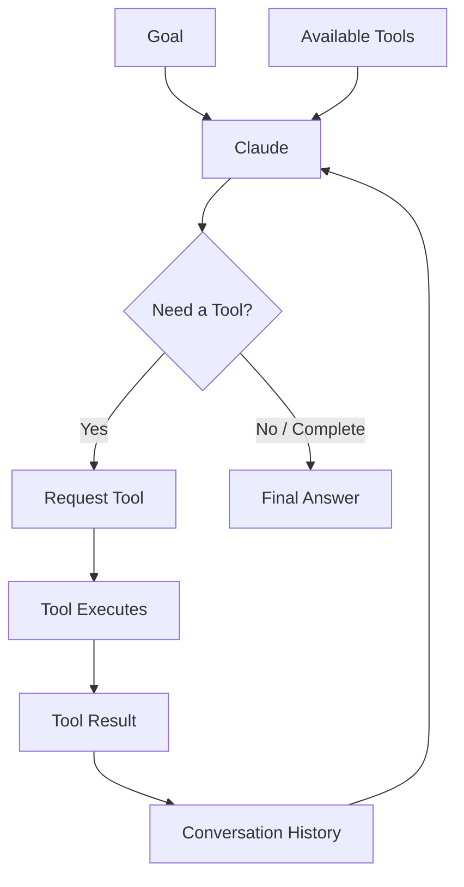

Claude continuously works with three important elements:

| Element     | Meaning                          |
| ----------- | -------------------------------- |
| **Goal**    | What the user wants to achieve   |
| **Tools**   | Capabilities available to Claude |
| **History** | What has happened so far         |

As the loop executes, the conversation history grows.

---

# 3. Tool-Use Lifecycle

For a **client-executed tool**, Claude does not directly execute your application function.

Claude requests that a tool be used.

The surrounding application executes it and returns the result.

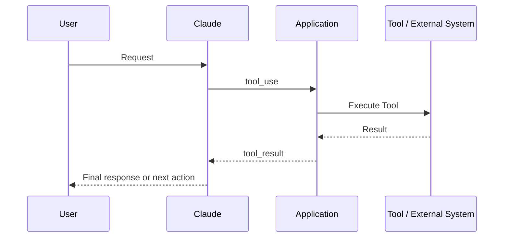

### Example

User asks:

> "What is the status of order 54321?"

Claude may request:

```text
get_order(order_id="54321")
```

Your application executes the function.

The tool returns:

```text
Status: Shipped
Expected delivery: 25 August
```

Claude then uses that result to answer the user.

---

# 4. `stop_reason`

A Claude API response includes a structured `stop_reason`.

It tells the application **why Claude stopped generating**.

Two important values for the basic agent loop are:

| `stop_reason` | Meaning                                 | Typical Action                 |
| ------------- | --------------------------------------- | ------------------------------ |
| `tool_use`    | Claude wants a tool executed            | Execute tool and return result |
| `end_turn`    | Claude naturally completed its response | Return response to user        |

### Basic loop

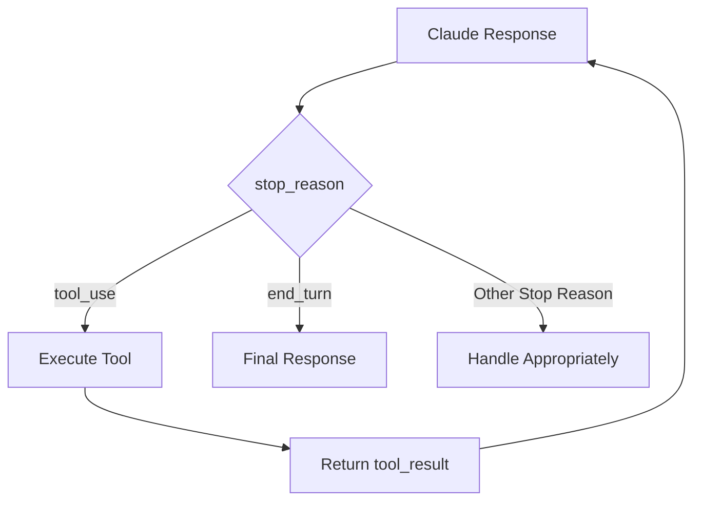

### Important

Do not decide that the agent is finished merely because its output *looks like* a final answer.

Use structured response state.

Other possible stop reasons also need appropriate application handling, such as token limits, stop sequences, paused server-tool execution, or refusals.

### Revision shortcut

```text
tool_use
    ↓
Action required


end_turn
    ↓
Normal completion
```

---

# 5. Coordinator and Subagent Architecture

Complex problems may benefit from multiple specialized agents.

One common architecture is:

* **Coordinator** → planner and orchestrator
* **Subagents** → specialists

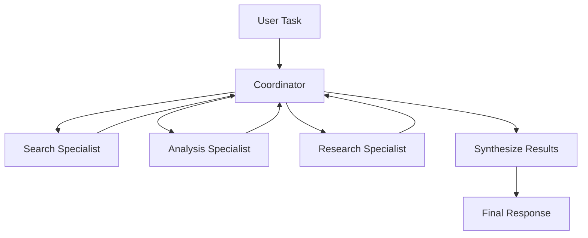

---

# 6. Coordinator Responsibilities

My notes summarize the coordinator role using four actions:

| Responsibility | Meaning                                 |
| -------------- | --------------------------------------- |
| **Decompose**  | Break the problem into smaller tasks    |
| **Delegate**   | Assign tasks to appropriate specialists |
| **Aggregate**  | Combine specialist results              |
| **Decide**     | Determine what needs to happen next     |

### Example

Suppose the task is:

> "Analyze why our cloud application is slow and give recommendations."

The coordinator might decompose it into:

```text
Cloud Performance Investigation
            │
    ┌───────┼─────────┐
    ↓       ↓         ↓
Metrics   Logs     Architecture
Analysis Analysis    Review
    │       │         │
    └───────┼─────────┘
            ↓
        Coordinator
            ↓
       Final Findings
```

---

# 7. Subagents

A subagent is a specialist used for a particular category of work.

A useful subagent definition contains three major components.

| Component         | Purpose                                            |
| ----------------- | -------------------------------------------------- |
| **Description**   | Explains when the subagent should be used          |
| **System Prompt** | Defines how the subagent should behave             |
| **Tools**         | Defines which capabilities the subagent can access |

### Mental model

```text
Subagent
│
├── Description
│      └── When should I use this specialist?
│
├── System Prompt
│      └── How should this specialist behave?
│
└── Tools
       └── What is this specialist allowed to do?
```

Think of the **description** like a job description.

---

# 8. Subagent Context

A subagent operates with its own context.

Therefore, good delegation matters.

Poor delegation:

```text
"Investigate this."
```

Better delegation:

```text
Goal:
Find the root cause of the API latency.

Current Evidence:
CPU normal.
Database response time increased.

Required Output:
Likely cause + evidence + recommendation.

Available Tools:
Metrics and log search.
```

### Important principle

> Provide the specialist the context required for the task — not every piece of information available to the parent.

---

# 9. Coordinator Communication Pattern

In a normal subagent architecture:

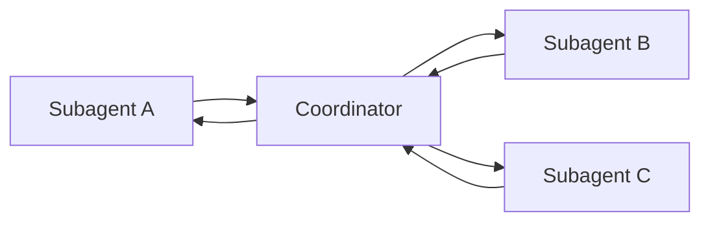

Subagents complete delegated work and return results to the parent/coordinator.

The coordinator manages the overall flow and combines the findings.

---

# 10. Iterative Refinement

The first specialist response does not necessarily mean the job is finished.

A coordinator can identify gaps and delegate additional work.

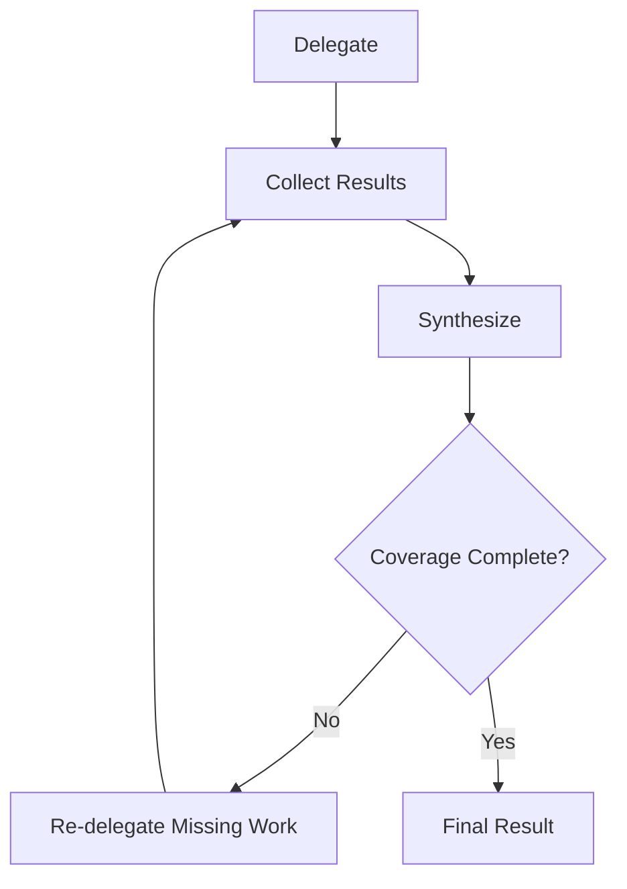

### Example

Initial analysis:

```text
Search Agent
→ Found service errors.

Monitoring Agent
→ Found CPU normal.

Architecture Agent
→ No database analysis performed.
```

Coordinator identifies the gap:

```text
Need database investigation.
```

It delegates again before producing the final report.

---

# 11. Task Decomposition Strategies

My notes identify two important approaches.

## Strategy 1 — Prompt Chaining

Use prompt chaining when the steps are known in advance.

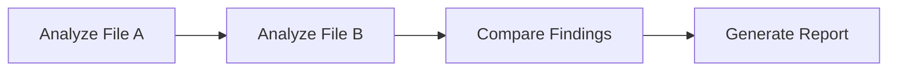

### Real Example — Fixed Security Review

```text
1. Read configuration
2. Identify security issues
3. Compare with policy
4. Produce recommendations
```

The sequence is known before execution begins.

---

## Strategy 2 — Dynamic Decomposition

Use dynamic decomposition when future actions depend on what is discovered.

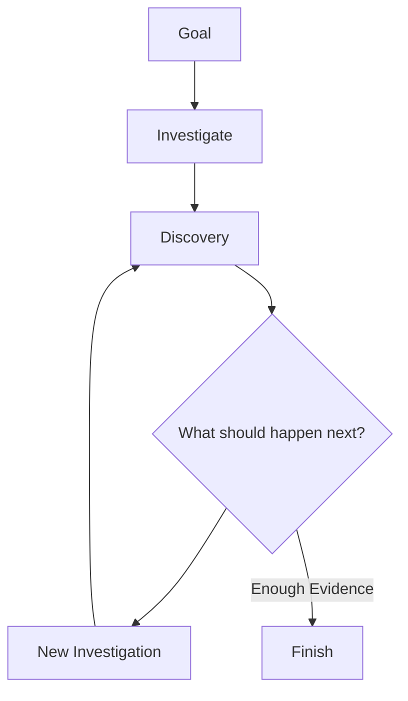

### Real Example — Production Incident

Initial problem:

> "Application is returning HTTP 500 errors."

The agent may discover:

```text
Step 1
Check application logs
       ↓
Discovery: Database timeout

Step 2
Check database health
       ↓
Discovery: Connection pool exhausted

Step 3
Inspect connection configuration
       ↓
Root Cause Found
```

The exact sequence could not be predetermined.

---

# 12. Prompt Chaining vs Dynamic Decomposition

| Characteristic         | Prompt Chaining        | Dynamic Decomposition     |
| ---------------------- | ---------------------- | ------------------------- |
| Workflow               | Predetermined          | Adaptive                  |
| Steps known beforehand | Yes                    | Not necessarily           |
| Best for               | Repeatable workflows   | Investigation / discovery |
| Predictability         | High                   | Lower                     |
| Flexibility            | Lower                  | Higher                    |
| Example                | Fixed review checklist | Incident troubleshooting  |

### Revision shortcut

```text
Known steps
→ Chaining


Unknown path
→ Dynamic decomposition
```

---

# 13. Guidance vs Enforcement

This is one of the most important concepts in these notes.

## Guidance

A prompt can tell Claude:

> "Verify the customer before processing a refund."

This guides model behaviour.

```text
Prompt
  ↓
Model interprets instruction
  ↓
Model decides how to behave
```

This is **probabilistic**.

---

## Enforcement

Software can make the rule mandatory.

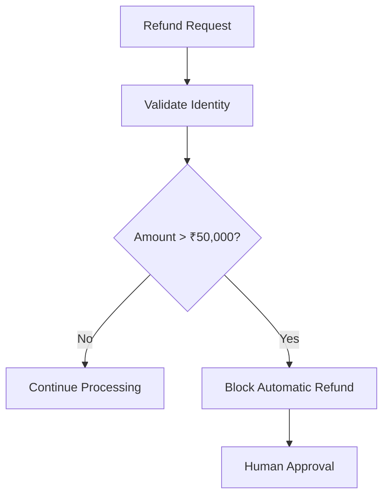

The application prevents the model from bypassing the rule.

### Comparison

| Guidance             | Enforcement                 |
| -------------------- | --------------------------- |
| Prompt-based         | Code/policy-based           |
| Influences behaviour | Controls behaviour          |
| Probabilistic        | Can be deterministic        |
| Good for preferences | Good for mandatory controls |
| Model may interpret  | System enforces             |

### Revision shortcut

```text
Prompt
→ Please do this.


Control / Gate
→ You cannot proceed unless this passes.
```

---

# 14. When Enforcement Matters

My notes highlight four major areas.

| Area           | Example                                |
| -------------- | -------------------------------------- |
| **Money**      | Refunds, payments, fund movement       |
| **Identity**   | Verify the person requesting an action |
| **Safety**     | Prevent harmful operations             |
| **Compliance** | Enforce mandatory policies             |

### Example

A customer asks:

> "Refund ₹60,000."

Prompt-only approach:

```text
Please obtain approval for large refunds.
```

Better controlled architecture:

```text
Refund Tool
    ↓
Amount Validation
    ↓
₹60,000 > ₹50,000
    ↓
BLOCK
    ↓
Human Approval
```

---

# 15. Hooks

Hooks execute at defined points in an agent workflow.

Two important lifecycle points from my notes are:

* `PreToolUse`
* `PostToolUse`

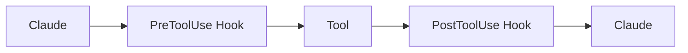

---

# 16. `PreToolUse`

Runs before a tool executes.

Possible uses:

* validate the request
* block unsafe operations
* enforce policy
* request approval
* audit the action

### Example

```text
Claude requests:

refund(amount=60000)

        ↓

PreToolUse

        ↓

Policy:
Maximum automated refund = ₹50,000

        ↓

BLOCK

        ↓

Human Approval
```

---

# 17. `PostToolUse`

Runs after successful tool execution.

Possible uses:

* normalize results
* audit output
* transform data
* trigger follow-up automation

### Example — Date Normalization

Different tools return:

```text
22/08/2026

2026-08-22

Aug 22 2026
```

A post-tool process could normalize them into:

```text
2026-08-22
```

---

# 18. Multi-Part Requests

Users frequently combine several requests in one message.

Example:

> "Refund my order, change my delivery address, and tell me when the replacement will arrive."

The agent can separate the intents.

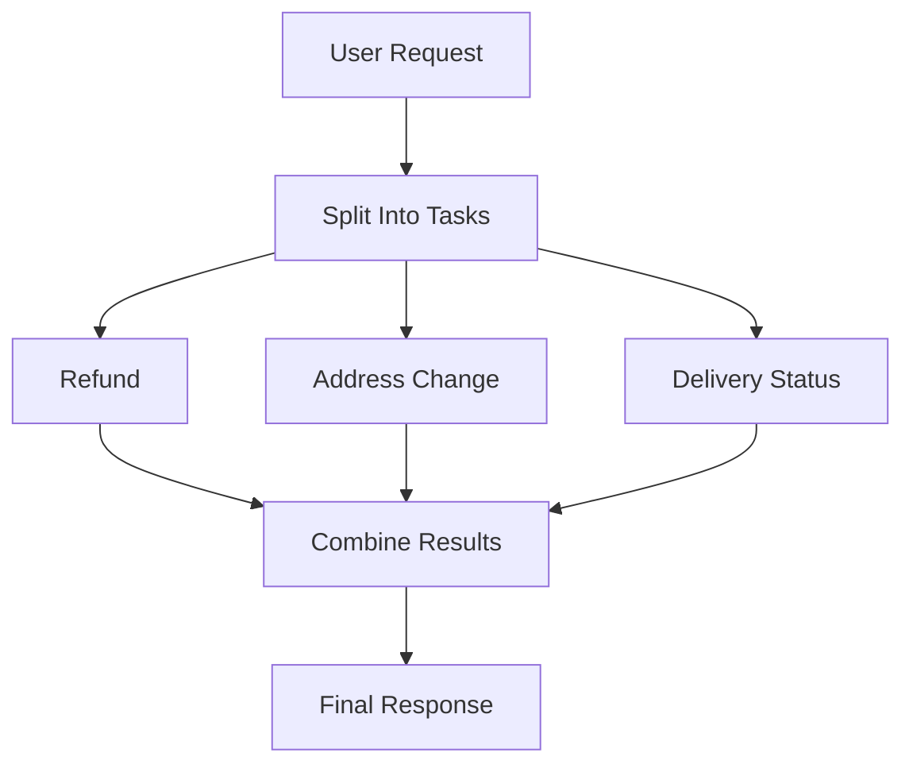

### Pattern

```text
Split
  ↓
Handle
  ↓
Reunite
```

---

# 19. Human Handoff

Automation should not continue indefinitely when human judgment is required.

A good handoff should preserve the context already collected.

### Poor handoff

```text
"Please contact the customer."
```

The human must start again.

### Better handoff

| Field                 | Example                         |
| --------------------- | ------------------------------- |
| Case ID               | REF-1024                        |
| Issue                 | Refund above approval threshold |
| Amount                | ₹60,000                         |
| Investigation         | Customer and order verified     |
| Reason for escalation | Automated limit exceeded        |
| Recommended action    | Manager approval                |

### Architecture

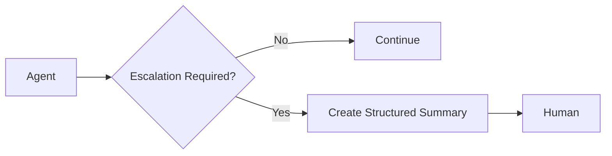

> **Key Principle:** A good handoff transfers **context**, not just responsibility.

---

# 20. Sessions

A session maintains conversational state.

```text
Session
  │
  ├── User Messages
  ├── Claude Responses
  ├── Tool Calls
  └── Tool Results
```

A saved session allows work to be resumed rather than starting from zero.

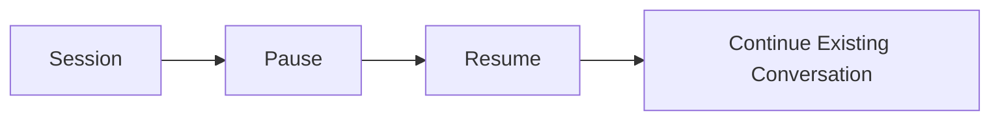

---

# 21. Session Forking

Forking creates a new conversational branch from existing history.

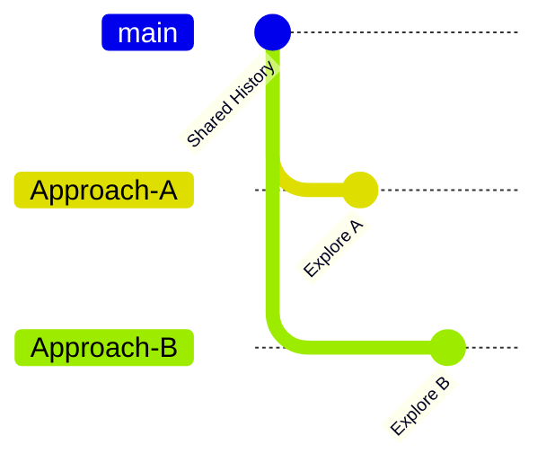

Conceptually:

```text
               Shared History
                     │
              ┌──────┴──────┐
              ↓             ↓
           Fork A         Fork B
              ↓             ↓
         Approach A     Approach B
```

The two conversations share the earlier history but evolve independently.

### Example

Original analysis:

```text
Authentication architecture reviewed.
```

Fork A:

```text
Explore JWT design.
```

Fork B:

```text
Explore OAuth design.
```

Both can be investigated without overwriting the original conversation path.

---

# 22. Domain Architecture Summary

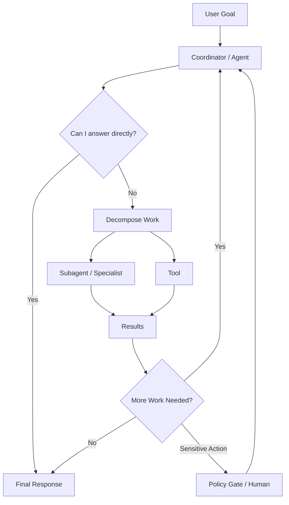

---

# 23. Quick Revision Table

| Concept               | Remember                          |
| --------------------- | --------------------------------- |
| Chatbot               | Request → Answer                  |
| Agent                 | Decide → Act → Observe → Repeat   |
| Agent Loop            | Goal + Tools + History            |
| `tool_use`            | Tool execution required           |
| `tool_result`         | Result sent back to Claude        |
| `end_turn`            | Normal completion                 |
| Coordinator           | Decomposes, delegates, aggregates |
| Subagent              | Specialized worker                |
| Context Passing       | Give specialist what it needs     |
| Prompt Chaining       | Fixed known steps                 |
| Dynamic Decomposition | Steps discovered dynamically      |
| Prompt                | Guidance                          |
| Hook / Gate           | Enforcement mechanism             |
| Human Handoff         | Transfer context + responsibility |
| Session               | Saved conversation state          |
| Fork                  | New branch from shared history    |

---

# Final Mental Model

```text
Agentic Architecture

Goal
 ↓
Understand
 ↓
Plan / Decompose
 ↓
Choose Action
 ↓
Tool or Subagent
 ↓
Observe Result
 ↓
Validate / Apply Controls
 ↓
Continue if required
 ↓
Human Escalation if required
 ↓
Final Response
```

> **Domain 1 in one sentence:**
> Agentic architecture is about controlling how an AI system **decides, acts, observes, delegates, loops, and safely reaches a result**.
