# Domain 2 — Tools, MCP & Claude Code

Domain 2 focuses on how Claude interacts with capabilities and information outside the language model.

The progression is:

```text
Claude
  ↓
Tools
  ↓
Tool Design
  ↓
Tool Selection
  ↓
Tool Execution
  ↓
Error Handling
  ↓
MCP
  ↓
Claude Code
```

---

# 1. What Is a Tool?

A **tool** is a capability made available to Claude.

Without external tools, Claude primarily works with the information available in its context and produces responses.

Tools allow Claude-enabled systems to interact with external capabilities such as:

* APIs
* databases
* monitoring platforms
* ticketing systems
* files
* command-line environments
* business applications

### Example

User asks:

> "What is the current status of order 54321?"

Claude may need information it does not already have.

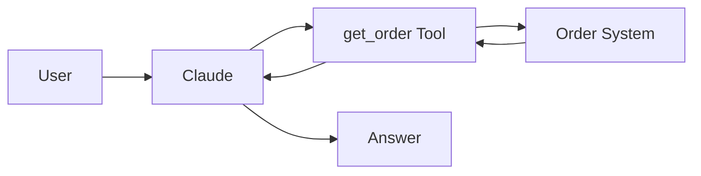

---

# 2. Tool Lifecycle

For a client tool:

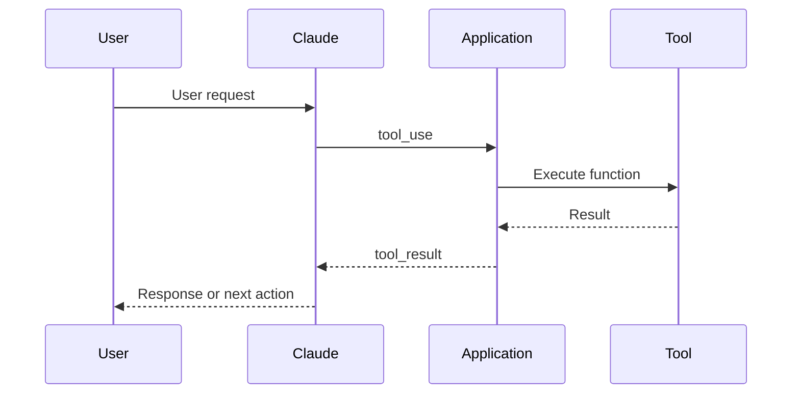

### Mental model

```text
Claude decides WHAT capability it wants.

The execution environment performs the operation.

The result returns to Claude.
```

---

# 3. Client Tools vs Server Tools

It is useful to distinguish where execution occurs.

| Tool Type       | Who Executes It?             | Example Pattern                      |
| --------------- | ---------------------------- | ------------------------------------ |
| **Client Tool** | Your application/environment | Internal API, custom function        |
| **Server Tool** | Anthropic infrastructure     | Anthropic-provided server capability |

### Client tool

```text
Claude
  ↓
tool_use
  ↓
Your Application
  ↓
External System
  ↓
tool_result
  ↓
Claude
```

### Server tool

```text
Claude
  ↓
Anthropic Server Tool
  ↓
Result
  ↓
Claude
```

---

# 4. Tool Definition

Claude needs a structured definition of an available tool.

Three fundamental elements are:

```text
Name
Description
Input Schema
```

Conceptual example:

```json
{
  "name": "get_order_by_id",
  "description": "Retrieve an order when its unique order ID is known.",
  "input_schema": {
    "type": "object",
    "properties": {
      "order_id": {
        "type": "string"
      }
    },
    "required": ["order_id"]
  }
}
```

---

# 5. Why Tool Descriptions Matter

Claude uses the available tool definitions to understand which capability is appropriate.

A vague definition creates ambiguity.

### Poor

```text
Name:
get_data

Description:
Gets data.
```

Claude cannot easily determine:

* what data
* when to use it
* what input is expected

---

### Better

```text
Name:
get_order_by_id

Description:
Retrieve order details when a unique order ID
is available. Use this for a specific known order.
```

---

# 6. Anatomy of a Good Tool Description

A practical description should answer:

| Question                           | Example                 |
| ---------------------------------- | ----------------------- |
| **What does it do?**               | Retrieves an order      |
| **When should it be used?**        | When order ID is known  |
| **What information does it need?** | `order_id`              |
| **What should not use it?**        | General customer search |

### Example

Two tools:

```text
get_order_by_id
```

and

```text
search_orders_by_customer
```

The descriptions should make the distinction obvious.

---

# 7. Tool Naming and Ambiguity

Poor naming:

```text
get_data
find_data
lookup_data
```

Better naming:

```text
get_order_by_id

search_orders_by_customer

get_customer_profile
```

### Rule

> Tool names should communicate intent before Claude even reads the full description.

---

# 8. Tool Distribution

Do not give every agent every available tool.

### Poor architecture

```text
Support Agent
│
├── Search Customer
├── Search Order
├── Delete Customer
├── Issue Refund
├── Modify Billing
├── Restart Server
├── Delete Database
└── 40 other tools...
```

The decision space becomes unnecessarily broad.

---

### Better architecture

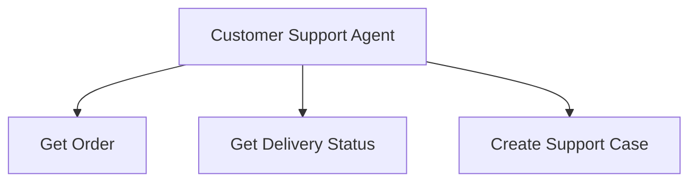

Another specialist can receive a different toolset.

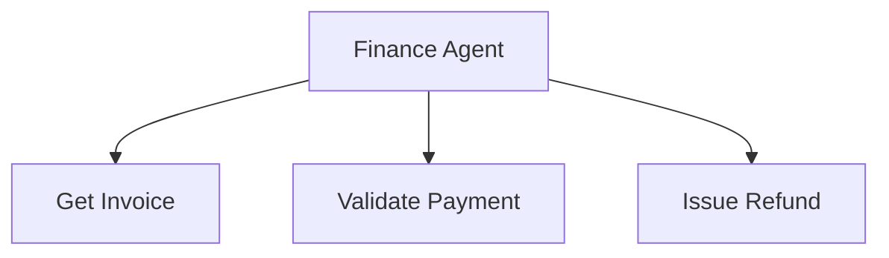

### Benefits

* clearer responsibilities
* lower ambiguity
* reduced blast radius
* least-privilege design
* easier governance

---

# 9. Tool Choice

Tool choice controls how Claude may use the supplied tools.

| Mode   | Meaning                                    |
| ------ | ------------------------------------------ |
| `auto` | Claude decides whether a tool is needed    |
| `any`  | Claude must use one of the available tools |
| `tool` | Claude must use the specified tool         |
| `none` | Claude cannot use a tool                   |

---

# 10. `auto`

Claude decides whether to answer directly or call a tool.

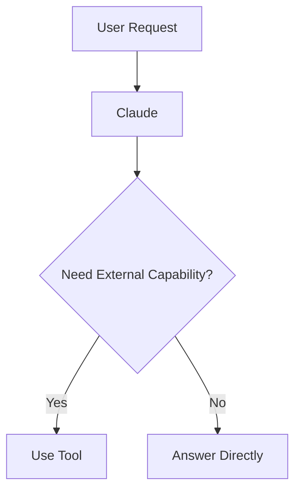

Example:

> "What is an API?"

Claude may answer directly.

But:

> "What is the status of my order 12345?"

may require an order tool.

---

# 11. `any`

Claude must use a tool but chooses which one.

```text
Available:

get_customer
get_order
search_invoice

Requirement:

Use at least one tool.
```

Claude selects the appropriate one.

---

# 12. Specific `tool`

The application requires a particular tool.

Example:

```text
Must use:

get_order_by_id
```

This provides stronger control than simply asking Claude in a prompt.

---

# 13. `none`

Tool use is disabled.

Claude must respond without using the provided tools.

---

# 14. Prompt Guidance vs Tool Enforcement

Prompt:

```text
"Please use the order lookup tool."
```

This is model guidance.

Tool configuration can enforce:

```text
tool_choice
→ get_order_by_id
```

### Comparison

| Prompt               | Tool Configuration           |
| -------------------- | ---------------------------- |
| Guidance             | Programmatic control         |
| Model interprets     | System restricts             |
| Flexible             | Stronger guarantee           |
| Good for preferences | Good for mandatory behaviour |

This connects directly with Domain 1:

```text
Prompt
→ Guidance


Software Control
→ Enforcement
```

---

# 15. Tool Errors

A tool should return errors in a form the agent can understand and act upon.

Instead of an unexplained failure:

```text
Exception 0x0007F3...
```

return meaningful information.

Application-defined categories might include:

| Category   | Meaning                 | Typical Response   |
| ---------- | ----------------------- | ------------------ |
| Validation | Bad or missing input    | Fix input          |
| Permission | Action not allowed      | Escalate / explain |
| Not Found  | Requested object absent | Explain / ask user |
| Rate Limit | Too many requests       | Retry later        |
| Transient  | Temporary failure       | Retry may help     |

---

# 16. Example — Validation Error

Claude calls:

```text
get_order(order_id="")
```

Tool returns:

```text
Error Type: VALIDATION_ERROR
Message: order_id is required.
```

Claude now knows that repeating the exact request will not solve the problem.

---

# 17. Example — Permission Error

Request:

```text
refund_order(amount=60000)
```

Result:

```text
Error Type: PERMISSION_DENIED
Message: Refund exceeds automated approval limit.
```

Possible next step:

```text
Human escalation
```

---

# 18. Example — Not Found

Tool:

```text
get_order_by_id("12345")
```

Result:

```text
NOT_FOUND
```

Correct interpretation:

```text
The request was valid.

The requested order does not exist.
```

Not:

```text
The system failed.
```

---

# 19. Retryable vs Non-Retryable

Not every error should trigger retries.

| Error                     | Retry Same Request? |
| ------------------------- | ------------------- |
| Validation failure        | ❌ No                |
| Authentication failure    | ❌ Usually no        |
| Permission failure        | ❌ No                |
| Not found                 | ❌ Usually no        |
| Temporary network problem | ✅ Possibly          |
| Service unavailable       | ✅ Possibly          |
| Rate limit                | ✅ After waiting     |

### Mental model

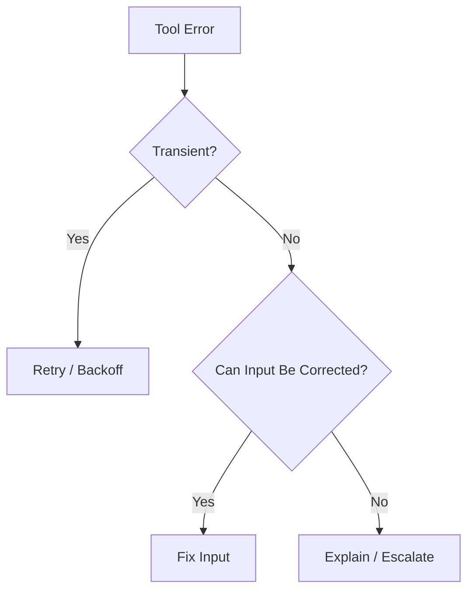

---

# 20. Success but Empty

One of the important distinctions from my notes:

```text
Success + No Results
```

is not:

```text
Failure
```

### Example

Search:

```text
search_orders_by_customer("ABC")
```

Result:

```json
{
  "status": "success",
  "orders": []
}
```

The system worked correctly.

There simply were no matching orders.

### Key takeaway

```text
Successful execution
≠
Successful match
```

---

# 21. Model Context Protocol — MCP

**MCP** stands for **Model Context Protocol**.

A useful mental model:

> MCP provides a standardized protocol through which AI applications can connect to external tools and sources of context.

Without a common integration approach:

```text
Claude → Custom Integration A

Claude → Custom Integration B

Claude → Custom Integration C
```

With MCP:

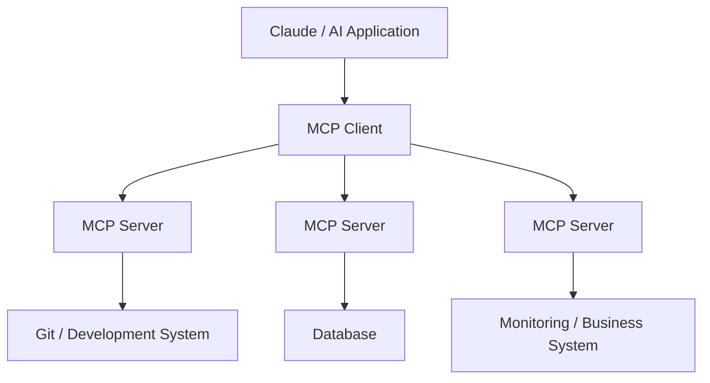

---

# 22. Why MCP Matters

Consider integrating an AI application with:

* source control
* ticketing systems
* databases
* monitoring
* internal APIs

Without a standard protocol, every integration can require a separate custom interface.

MCP provides a common integration pattern.

```text
AI Application
      ↓
     MCP
      ↓
External Systems
```

---

# 23. MCP Tool vs Resource

My notes capture an important distinction.

## Tool

A tool exposes an operation.

Examples:

```text
create_issue()

run_query()

search_orders()
```

Mental model:

```text
Tool
→ Do something
```

---

## Resource

A resource exposes information or context.

Examples:

```text
Documentation

Configuration

File

Database schema
```

Mental model:

```text
Resource
→ Provide information
```

---

# 24. Tool vs Resource Table

| Tool                  | Resource              |
| --------------------- | --------------------- |
| Performs an operation | Provides information  |
| Action-oriented       | Context-oriented      |
| May change state      | Often read-oriented   |
| `create_issue`        | Project documentation |
| `run_query`           | Database schema       |
| `update_ticket`       | Configuration file    |

### Revision shortcut

```text
Tool
→ Action


Resource
→ Context
```

---

# 25. MCP Server Architecture

An MCP server sits between the AI client and an external capability.

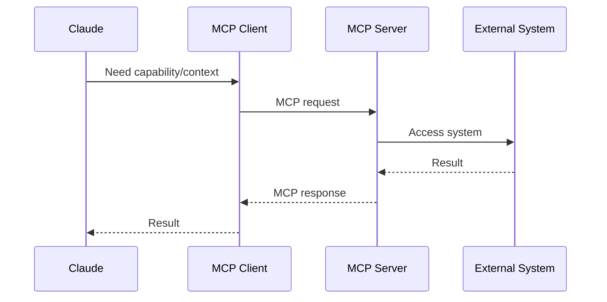

---

# 26. MCP Connection Types

Two important practical connection models are:

| Connection        | Typical Use                    |
| ----------------- | ------------------------------ |
| **Local / stdio** | Local process or custom script |
| **HTTP**          | Remote MCP service             |

### Local

```text
Claude Code
    ↓
Local MCP Server
    ↓
Local / External Capability
```

### Remote

```text
Claude Code
    ↓
HTTP
    ↓
Remote MCP Server
    ↓
External Service
```

---

# 27. Configuration Scopes

Claude Code MCP configuration can use three important scopes.

| Scope       | Available To         | Shared With Team |
| ----------- | -------------------- | ---------------- |
| **Local**   | You, current project | No               |
| **Project** | Current project      | Yes              |
| **User**    | You, across projects | No               |

---

# 28. Local Scope

Use for:

* personal project-specific servers
* experimentation
* machine-specific configuration

```text
Project A

Developer
   ↓
Local MCP Config
```

Another user does not automatically receive it.

---

# 29. Project Scope

Use when the MCP configuration should be shared with the project/team.

```text
Repository
    ↓
.mcp.json
    ↓
Team
```

The project configuration can be maintained in version control.

Credentials themselves should not be committed.

---

# 30. User Scope

Use when you want the MCP server available across your projects.

```text
User
 │
 ├── Project A
 ├── Project B
 └── Project C
```

Example:

A personal development utility used in many repositories.

---

# 31. Scope Precedence

When the same MCP server name exists at multiple scopes, the more specific configuration takes precedence.

A useful revision order is:

```text
Local
  ↓
Project
  ↓
User
```

Think:

```text
Most specific
      ↓
Most general
```

---

# 32. Configuration and Secrets

Do not put secrets directly into source-controlled configuration.

Poor:

```json
{
  "api_key": "my-real-secret-key"
}
```

Better pattern:


Example concept:

```text
API_KEY=${API_KEY}
```

### Principle

> Configuration can describe **where a secret comes from** without embedding the secret itself.

---

# 33. Claude Code Built-in Tools

Several Claude Code tools are particularly important for revision.

| Tool      | Purpose                             |
| --------- | ----------------------------------- |
| **Read**  | Read existing files                 |
| **Write** | Create or overwrite file content    |
| **Edit**  | Modify specific file content        |
| **Bash**  | Execute shell commands              |
| **Grep**  | Search content inside files         |
| **Glob**  | Find files using path/name patterns |

---

# 34. Read

Used to inspect existing content.

```text
Read
  ↓
Understand
```

Example:

```text
Read application.yaml
```

Use it before making changes when you first need to understand a file.

---

# 35. Write

Writes file content.

```text
Write
  ↓
Create / Replace
```

Example:

```text
Create README.md
```

---

# 36. Edit

Changes a specific part of an existing file.

```text
Existing File
     ↓
Locate Content
     ↓
Edit
     ↓
Updated File
```

Example:

```text
Change:

timeout = 30

to:

timeout = 60
```

---

# 37. Bash

Executes shell commands.

Examples:

```text
git status

terraform validate

pytest

npm test
```

Mental model:

```text
Bash
→ Execute command
```

---

# 38. Grep

Grep searches **inside files**.

Question:

> "Which files contain `payment_failed`?"

Use:

```text
Grep
```

Conceptually:

```text
File A → no

File B → payment_failed ✓

File C → no
```

---

# 39. Glob

Glob locates files using a filename/path pattern.

Question:

> "Find all JSON configuration files."

Use a pattern such as:

```text
**/*.json
```

Conceptually:

```text
Repository
   ↓
Glob
   ↓
config/app.json
config/db.json
tests/data.json
```

---

# 40. Grep vs Glob

This is an important quick-revision distinction.

| Grep                            | Glob                              |
| ------------------------------- | --------------------------------- |
| Searches content                | Searches filenames/paths          |
| "What files contain this text?" | "Which files match this pattern?" |
| Search inside files             | Locate files                      |
| Example: `payment_failed`       | Example: `**/*.json`              |

### Memory trick

```text
Grep
→ What's INSIDE?


Glob
→ WHERE is the file?
```

---

# 41. Read Before Edit

A useful Claude Code working pattern is:

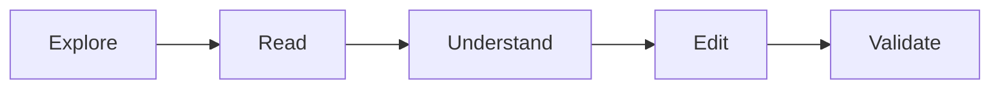

### Example

Poor:

```text
Immediately edit nginx.conf
```

Better:

```text
1. Find nginx configuration
2. Read current configuration
3. Understand relevant block
4. Edit required value
5. Validate configuration
```

---

# 42. Real Example — Cloud Incident Investigation

Suppose the request is:

> "Investigate why the production API is returning HTTP 500 errors."

Claude Code could use:

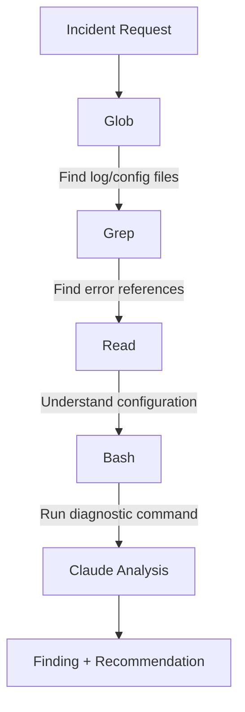

Possible tool sequence:

```text
Glob
→ Find application logs

Grep
→ Search for HTTP 500 / exceptions

Read
→ Inspect relevant log/configuration

Bash
→ Run diagnostic command

Claude
→ Correlate findings
```

This demonstrates that individual tools are simple, but the **agentic workflow combining them creates the capability**.

---

# 43. Real Example — MCP + Cloud Operations

Suppose an enterprise exposes a monitoring platform through an MCP server.

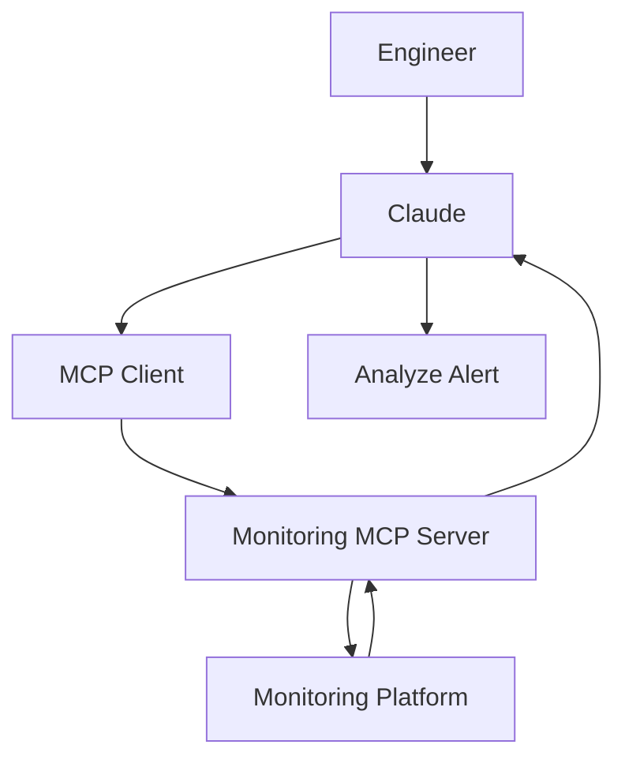

User asks:

> "Why is production web server latency increasing?"

The MCP-connected capability can provide current monitoring information.

Claude then reasons over the returned context.

---

# 44. Domain Architecture Summary

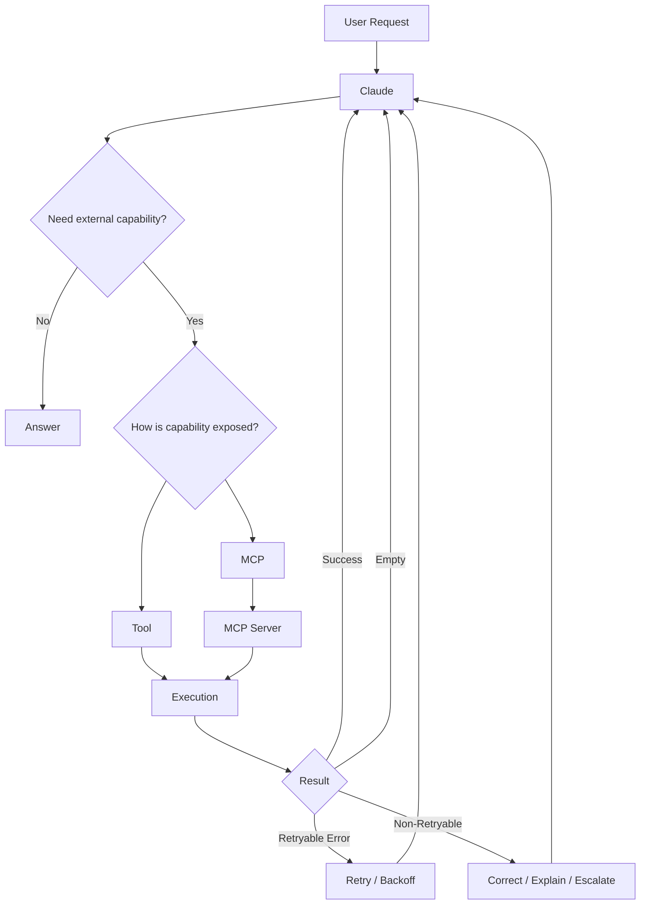

---

# 45. Quick Revision Table

| Concept          | Remember                                             |
| ---------------- | ---------------------------------------------------- |
| Tool             | Capability available to Claude                       |
| Tool Definition  | Name + Description + Input Schema                    |
| Tool Description | Helps Claude understand when to use it               |
| Client Tool      | Your environment executes it                         |
| Server Tool      | Anthropic infrastructure executes it                 |
| `auto`           | Claude decides                                       |
| `any`            | Claude must use a tool                               |
| `tool`           | Specific tool required                               |
| `none`           | Tool usage disabled                                  |
| Validation Error | Input problem                                        |
| Permission Error | Operation not authorized                             |
| Not Found        | Valid request, object absent                         |
| Transient Error  | Retry may help                                       |
| Success + Empty  | Tool worked; nothing matched                         |
| MCP              | Standard protocol for AI/external-system integration |
| MCP Tool         | Performs an operation                                |
| MCP Resource     | Supplies context/information                         |
| Local Scope      | Personal, current project                            |
| Project Scope    | Team-shared project config                           |
| User Scope       | Personal, cross-project                              |
| Read             | Inspect file                                         |
| Write            | Create/replace file                                  |
| Edit             | Modify file                                          |
| Bash             | Execute shell                                        |
| Grep             | Search inside files                                  |
| Glob             | Locate files                                         |

---

# Final Mental Model

```text
Claude
   ↓
Needs Something Outside Its Context
   ↓
Select Capability
   ↓
Tool / MCP
   ↓
External System
   ↓
Structured Result
   ↓
Success / Empty / Error
   ↓
Claude Decides Next Action
   ↓
Continue or Respond
```

> **Domain 2 in one sentence:**
> Tool architecture is about giving Claude **well-described, controlled, reliable ways to interact with external systems**, while MCP provides a standardized integration model for exposing those capabilities and context.
