# Domain 3 — Claude Code Configuration, Memory & Workflows

Domain 3 focuses on how Claude Code can be configured to work consistently within a project through **persistent instructions, scoped rules, reusable skills, planning workflows, and controlled automation**.

The core idea is:

```text
Persistent Context
      +
Scoped Instructions
      +
Reusable Workflows
      +
Planning & Permissions
      +
Automation Controls
      ↓
Consistent Claude Code Behaviour
```

---

# 1. Persistent Project Context with `CLAUDE.md`

Every new Claude Code session starts with a fresh context window.

`CLAUDE.md` provides persistent instructions that Claude can load across sessions.

Instead of repeatedly explaining:

```text
"Use these coding conventions."
"Run these tests."
"This is how our project is structured."
"Follow this architecture pattern."
```

those instructions can be captured once in `CLAUDE.md`.

### Mental Model

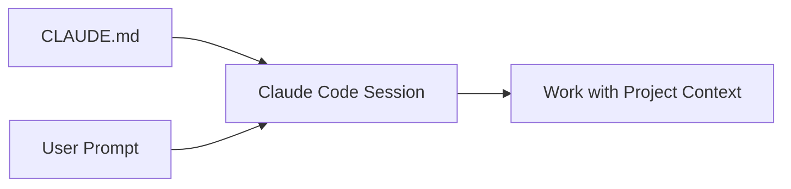

`CLAUDE.md` is therefore useful for information Claude should know consistently while working in a repository.

---

# 2. What Belongs in `CLAUDE.md`?

Good candidates include information Claude cannot reliably infer from the repository alone.

Examples:

- build and test commands
- project architecture
- coding conventions
- naming standards
- important repository structure
- team workflows
- recurring project-specific instructions

### Good Example

```markdown
# Build and Validation

- Run `npm test` before completing a change.
- API handlers are located under `src/api/handlers/`.
- Use the existing repository error-response format.

# Architecture

- Business logic belongs in the service layer.
- Controllers should remain thin.
```

### Poor Example

```markdown
Write good code.
Use best practices.
Make everything secure.
```

The second example is difficult to verify because the criteria are vague.

### Key Principle

> Write instructions that are concrete, specific, and verifiable.

Keep `CLAUDE.md` concise. As a practical guideline, target fewer than approximately **200 lines** and move specialized instructions elsewhere when appropriate.

---

# 3. `CLAUDE.md` Scope and Hierarchy

Claude Code supports instructions at different scopes.

| Scope | Typical Location | Purpose |
|---|---|---|
| **Managed / Organization** | OS-managed Claude Code location | Organization-wide instructions |
| **User** | `~/.claude/CLAUDE.md` | Personal preferences across projects |
| **Project** | `./CLAUDE.md` or `./.claude/CLAUDE.md` | Shared repository instructions |
| **Local** | `./CLAUDE.local.md` | Personal instructions for one project |
| **Nested Directory** | `<directory>/CLAUDE.md` | Instructions relevant to a subdirectory |

### Architecture

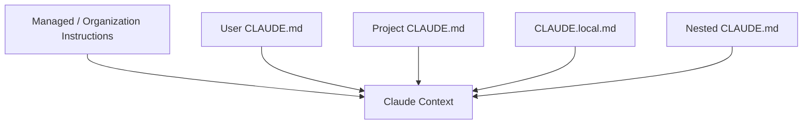

An important detail is that these instruction files are generally **combined into Claude's context** rather than functioning like deterministic configuration overrides.

More specific instructions appear later in the context, but conflicting instructions should still be avoided.

---

# 4. Nested Directory Memory

Large repositories may contain different applications or components.

Example:

```text
repository/
│
├── CLAUDE.md
│
├── frontend/
│   └── CLAUDE.md
│
└── backend/
    └── CLAUDE.md
```

The root file may contain project-wide instructions.

The nested files can contain instructions specific to their areas.

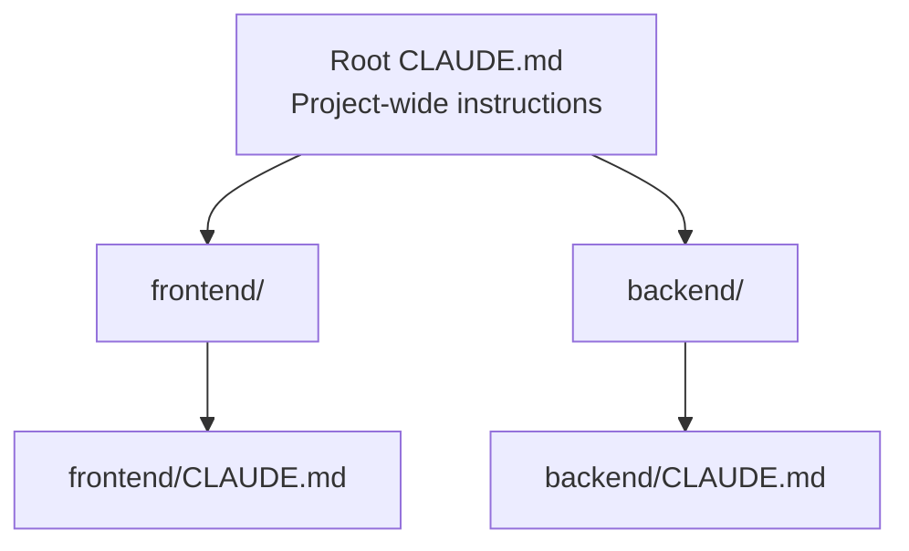

Claude Code does not need to load every nested instruction file immediately.

Nested instructions can be brought into context when Claude works with files in the relevant directory.

### Why This Matters

This keeps:

- project-wide rules broadly available
- specialized rules close to relevant code
- unnecessary context out of unrelated work

---

# 5. Real-World Scenario — Enterprise IaC Repository

Consider an infrastructure repository:

```text
cloud-platform/
│
├── CLAUDE.md
├── modules/
│   └── CLAUDE.md
└── environments/
    ├── dev/
    └── prod/
        └── CLAUDE.md
```

The root `CLAUDE.md` might contain:

```markdown
# Repository Conventions

- Run `terraform fmt -check` before completing changes.
- Run `terraform validate` for modified Terraform modules.
- Reuse existing modules before introducing new resources.
```

The production directory could contain additional guidance:

```markdown
# Production Changes

- Treat production infrastructure changes as high impact.
- Review dependencies before modifying shared resources.
- Present the expected impact before making a broad change.
```

This demonstrates how instructions can become more relevant as Claude moves deeper into the repository.

> `CLAUDE.md` provides behavioral guidance. Mandatory security controls should still be enforced through permissions, hooks, CI/CD policies, or other deterministic mechanisms.

---

# 6. Importing Supporting Instructions

A `CLAUDE.md` file can reference supporting files using `@path`.

Example:

```markdown
# Additional Standards

- API standards: @docs/api-standards.md
- Git workflow: @docs/git-workflow.md
```

This can help keep the main file readable while maintaining supporting documentation separately.

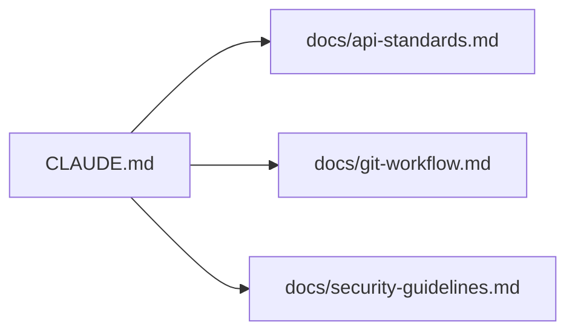

### Important

Imports help with organization, but imported content still consumes context.

---

# 7. `/memory`

Claude Code provides `/memory` to inspect and work with memory/instruction files.

Conceptually:

```text
/memory
   ↓
Review Memory Sources
   ↓
Inspect / Edit Instructions
```

This is useful when checking what persistent instructions Claude is using.

---

# 8. Organizing Instructions with `.claude/rules/`

As a project grows, one large `CLAUDE.md` can become difficult to maintain.

Claude Code supports modular project rules under:

```text
.claude/rules/
```

Example:

```text
.claude/
│
├── CLAUDE.md
│
└── rules/
    ├── api.md
    ├── testing.md
    ├── security.md
    └── code-style.md
```

Each file can focus on one concern.

### Benefits

| Single Large File | Modular Rules |
|---|---|
| Becomes difficult to maintain | Organized by concern |
| All instructions mixed together | Clear separation |
| More context may load than necessary | Rules can be scoped |
| Harder to assign ownership | Easier team maintenance |

---

# 9. Path-Specific Rules

Rules can be applied only when Claude works with matching files.

Example:

```markdown
---
paths:
  - "src/api/**/*.ts"
---

# API Rules

- Validate all external input.
- Use the project's standard API error format.
- Update API documentation when an endpoint changes.
```

Architecture:

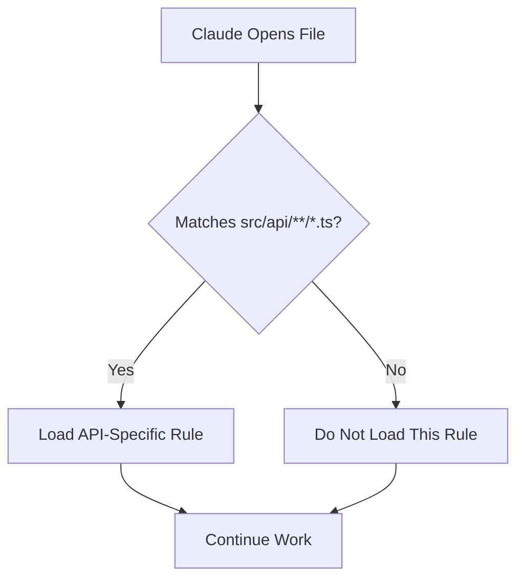

Rules without a `paths` field apply broadly.

Path-scoped rules are useful when a rule matters only for part of a repository.

---

# 10. Example — Area-Specific Repository Rules

```text
.claude/rules/
│
├── global-security.md
├── frontend.md
├── api.md
└── terraform-production.md
```

Example:

```markdown
---
paths:
  - "infra/prod/**/*.tf"
---

# Production Terraform Rules

- Validate configuration before completing a change.
- Review dependency impact.
- Avoid unrelated refactoring in production changes.
```

This keeps production-specific instructions out of unrelated application-development work.

---

# 11. `CLAUDE.md` vs Rules vs Skills

These mechanisms solve different problems.

| Mechanism | Best Used For | Loading Pattern |
|---|---|---|
| **CLAUDE.md** | Project-wide persistent context | Regularly loaded |
| **`.claude/rules/`** | Modular or path-specific instructions | Always or conditionally loaded |
| **Skill** | Reusable task/workflow | Loaded when invoked or relevant |

### Mental Model

```text
CLAUDE.md
    ↓
"What should Claude always know?"


Rules
    ↓
"What applies to this area/type of file?"


Skills
    ↓
"What reusable task should Claude know how to perform?"
```

---

# 12. Reusable Workflows with Skills

Repeated workflows should not require typing the same long instructions every time.

Claude Code Skills allow reusable instructions to be stored under:

```text
.claude/skills/<skill-name>/SKILL.md
```

Example:

```text
.claude/
└── skills/
    └── fix-issue/
        └── SKILL.md
```

A skill can then represent a reusable workflow such as:

- issue investigation
- code review
- release validation
- documentation generation
- incident analysis

---

# 13. Skill Example

```markdown
---
name: fix-issue
description: Investigate a reported issue and propose a focused fix.
argument-hint: "[issue-number]"
disable-model-invocation: true
---

Investigate issue $ARGUMENTS.

1. Locate the relevant implementation.
2. Identify the likely root cause.
3. Determine the minimum required change.
4. Implement the change only after understanding the impact.
5. Run the relevant validation.
6. Summarize the cause, change, and verification.
```

Invocation:

```text
/fix-issue 123
```

`$ARGUMENTS` receives:

```text
123
```

and makes the workflow reusable for different issues.

---

# 14. Important Skill Frontmatter

Common frontmatter fields include:

| Field | Purpose |
|---|---|
| `name` | Skill name |
| `description` | Explains what the skill does |
| `argument-hint` | Shows expected user input |
| `disable-model-invocation` | Prevents Claude from autonomously invoking it |
| `allowed-tools` | Pre-approves listed tools for the skill turn |
| `model` | Selects a model when required |
| `context: fork` | Runs the task in an isolated subagent context |

---

# 15. `disable-model-invocation`

For workflows with significant side effects, you may want the **user** to decide when the skill runs.

Example:

```yaml
disable-model-invocation: true
```

This means Claude does not autonomously invoke the skill.

The user can still invoke it explicitly:

```text
/deploy production
```

This is useful for operations where timing should remain user-controlled.

---

# 16. `allowed-tools`

A skill can pre-approve certain tools.

Example:

```yaml
allowed-tools: Read Grep
```

This means the listed tools can execute during that skill invocation without requiring their normal permission prompt.

### Important Distinction

```text
allowed-tools
     ≠
Only tools available
```

It **pre-approves** tools.

It does not itself remove all other tools from Claude's environment.

---

# 17. Running a Skill in an Isolated Context

A skill can use:

```yaml
context: fork
```

Example:

```markdown
---
name: deep-review
description: Perform an independent review of a change.
context: fork
agent: Explore
---

Review the relevant implementation for $ARGUMENTS.

Identify:
1. correctness issues
2. missing validation
3. security concerns
4. areas requiring follow-up
```

Architecture:


The forked skill runs in its own subagent context rather than simply continuing the current conversation history.

This is useful when independent analysis is desirable.

---

# 18. Skills vs Legacy Custom Commands

Claude Code continues to support files under:

```text
.claude/commands/
```

However, Skills provide a richer reusable workflow mechanism.

Conceptually:

```text
Legacy Custom Command
        ↓
.claude/commands/fix-issue.md


Skill
        ↓
.claude/skills/fix-issue/SKILL.md
```

For new reusable workflows, Skills provide additional capabilities such as structured metadata, controlled invocation, isolated execution context, and supporting files.

---

# 19. Plan Mode

Not every change should immediately modify code.

For complex or high-risk work, Claude Code provides **Plan Mode**.

Plan Mode allows Claude to investigate and develop a plan before editing files.

### Workflow

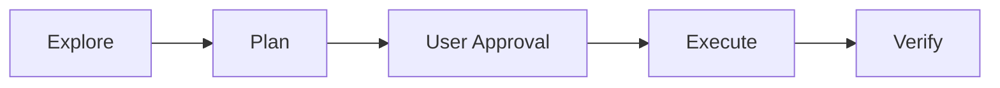

The planning phase is effectively read-only with respect to source edits.

---

# 20. When to Use Plan Mode

| Direct Execution | Plan Mode |
|---|---|
| Small isolated change | Multi-file refactor |
| Straightforward fix | Authentication change |
| Low-risk edit | Payment workflow change |
| Well-understood repository | Unfamiliar repository |
| Simple documentation change | Broad architecture change |

### Rule of Thumb

```text
Small + Clear + Low Risk
        ↓
Direct Work


Broad + Uncertain + High Impact
        ↓
Plan First
```

---

# 21. Entering Plan Mode

Current options include:

```text
Shift+Tab
```

or:

```text
/plan
```

or start Claude Code directly in Plan Mode:

```bash
claude --permission-mode plan
```

Claude can then explore and propose the change before implementation begins.

---

# 22. Real-World Scenario — Authentication Refactor

Suppose the request is:

> Replace the existing authentication middleware across several services.

Immediate editing creates unnecessary risk.

A better workflow is:

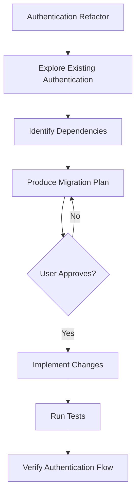

This is a good Plan Mode candidate because:

- multiple files are involved
- dependencies may not be obvious
- authentication is security-sensitive
- mistakes can affect the entire application

---

# 23. The Plan Loop

A useful mental model is:

```text
Explore
   ↓
Plan
   ↓
Approve
   ↓
Execute
   ↓
Verify
```

### Phase Responsibilities

| Phase | Purpose |
|---|---|
| Explore | Understand the repository and dependencies |
| Plan | Explain proposed changes |
| Approve | Human reviews approach |
| Execute | Modify implementation |
| Verify | Run appropriate validation |

---

# 24. Iterative Refinement

The first model response does not always need to be the final result.

Treat it as a draft when the task benefits from refinement.


Three practical techniques from this domain are:

### 1. Treat the First Output as a Draft

Instead of expecting perfection immediately:

```text
Draft
  ↓
Review
  ↓
Correct
  ↓
Refine
```

### 2. Provide Examples

Show both the input and the exact type of output expected.

Example:

```text
Input:
GET /customers/123

Expected Output:
{
  "customer_id": "123",
  "status": "active"
}
```

Examples reduce ambiguity.

### 3. Ask Claude to Clarify First

For an underspecified task:

```text
Before implementing this change,
ask the questions required to understand
the expected behaviour and constraints.
```

This is particularly useful when requirements are incomplete.

---

# 25. Sequential vs Parallel Work

Not every task must execute in the same order.

The key question is:

> Does one task depend on the result of another?

### Independent Tasks

```text
Task A ─┐
Task B ─┼──> Combine Results
Task C ─┘
```

These can often run in parallel.

### Dependent Tasks

```text
Task A
  ↓
Task B
  ↓
Task C
```

These should run sequentially.

---

# 26. Sequential vs Parallel Comparison

| Situation | Strategy |
|---|---|
| Independent reviews | Parallel |
| Independent file analysis | Parallel |
| One step produces input for another | Sequential |
| Schema → service → dependent tests | Sequential |
| Several independent investigations | Parallel |

### Example

Three independent reviewers checking:

- security
- performance
- documentation

can work independently.

But:

```text
Change Database Schema
        ↓
Update Service Layer
        ↓
Update Tests
```

contains dependencies and should be ordered.

---

# 27. Claude Code in CI/CD

Claude Code can also operate non-interactively.

This enables integration with:

- pull-request workflows
- scheduled jobs
- automated review
- scripted analysis
- CI/CD pipelines

The basic command is:

```bash
claude -p "your prompt"
```

`-p` runs Claude non-interactively and exits after producing the result.

---

# 28. CI/CD Architecture

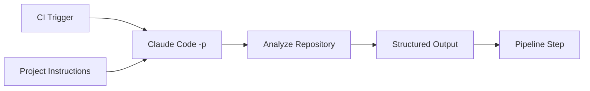

Example triggers might include:

```text
Pull Request
Scheduled Review
Repository Validation
Automated Analysis Job
```

---

# 29. Structured Output

Automation should avoid relying on free-form human-readable output when downstream systems need predictable data.

Claude Code can return JSON:

```bash
claude -p "Summarize the project" \
  --output-format json
```

For stricter automation, a JSON Schema can define the required result structure.

Example concept:

```json
{
  "risk": "medium",
  "summary": "Authentication logic was modified.",
  "requires_review": true
}
```

This is easier for a CI/CD system to process than arbitrary prose.

---

# 30. Safety Controls for Automated Runs

Unattended automation should have boundaries.

Useful controls include:

| Control | Purpose |
|---|---|
| `--max-turns` | Caps agentic turns |
| `--max-budget-usd` | Caps estimated API spend in print mode |
| `--tools` | Restricts available built-in tools |
| `--allowedTools` | Pre-approves specified tools |
| `--permission-prompts none` | Prevents interactive permission prompts |
| Structured output | Makes downstream processing predictable |

### Important

```text
--allowedTools
      ↓
Pre-approve tools


--tools
      ↓
Restrict available built-in tools
```

These are not the same control.

---

# 31. Example — Controlled CI Review

A read-oriented CI review could be constrained to specific tools and execution limits.

```bash
claude -p \
  "Review the current change for correctness and significant risks. Do not modify files." \
  --tools "Read,Grep,Glob" \
  --permission-prompts none \
  --max-turns 6 \
  --max-budget-usd 2.00 \
  --output-format json
```

Architecture:

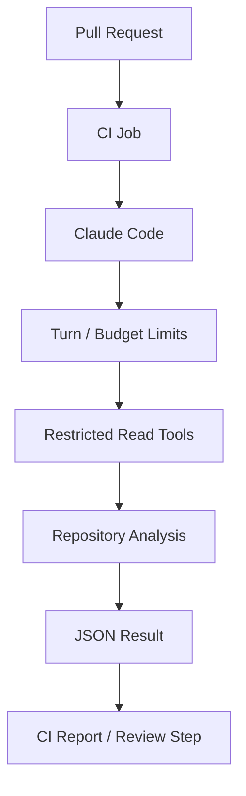

The exact limits should be selected according to the workflow rather than copied blindly.

---

# 32. `CLAUDE.md` in Automated Workflows

The same project context used during interactive development can provide useful repository guidance during automated runs.

Example:

```text
CLAUDE.md

- architecture conventions
- test commands
- project layout
- review expectations
```

Then:

```text
Developer Session
        +
CI Claude Code Run
        ↓
Shared Project Context
```

This improves consistency between interactive and automated usage.

Again, `CLAUDE.md` is guidance rather than a security boundary. Critical CI restrictions should be enforced separately.

---

# 33. Independent Review Pattern

For an important implementation, it can be useful to separate:

```text
Implementation Context
```

from:

```text
Independent Review Context
```

Architecture:

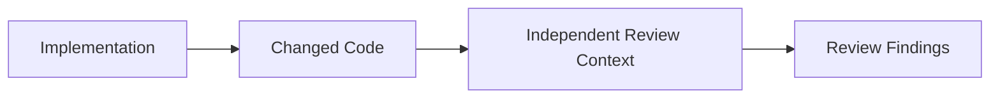

An isolated skill/subagent or separate automated review can reduce the risk that the review simply follows the same assumptions used during implementation.

---

# 34. Domain Architecture Summary

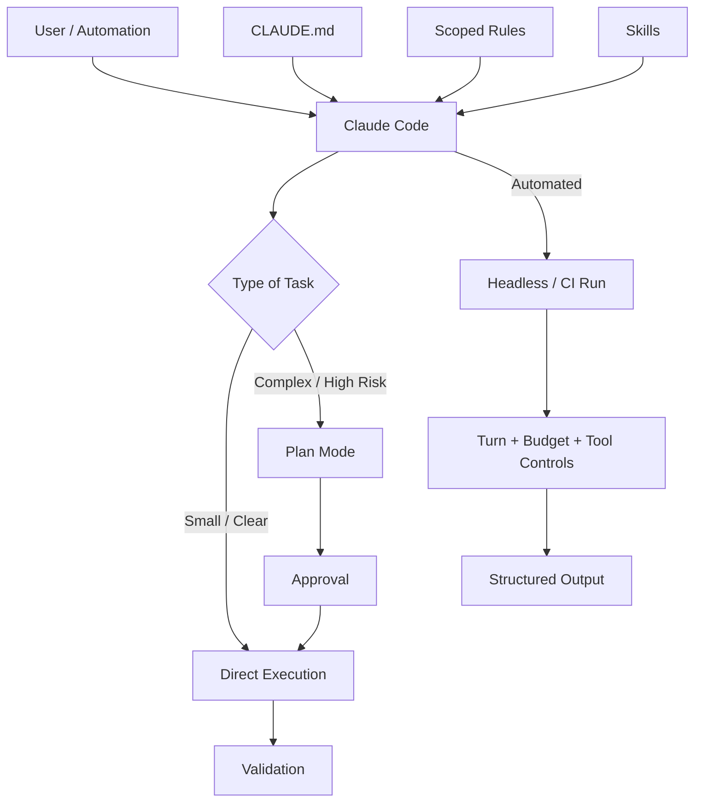

---

# 35. Quick Revision

| Concept | Remember |
|---|---|
| `CLAUDE.md` | Persistent instructions/context |
| User CLAUDE.md | Personal instructions across projects |
| Project CLAUDE.md | Shared project instructions |
| `CLAUDE.local.md` | Personal instructions for one project |
| Nested CLAUDE.md | Subdirectory-specific context |
| `@file` | Import supporting instructions |
| `/memory` | Inspect/manage memory sources |
| `.claude/rules/` | Modular project instructions |
| `paths` | Conditionally scope a rule |
| Rule without `paths` | Broadly loaded |
| Skill | Reusable workflow |
| `$ARGUMENTS` | User input passed into a skill |
| `disable-model-invocation` | User controls when skill runs |
| `allowed-tools` | Pre-approves listed tools for skill invocation |
| `context: fork` | Run skill in isolated subagent context |
| Plan Mode | Explore/plan before editing |
| Direct execution | Appropriate for small clear changes |
| Parallel work | Independent tasks |
| Sequential work | Dependent tasks |
| `claude -p` | Non-interactive execution |
| `--max-turns` | Limit agentic turns |
| `--max-budget-usd` | Limit estimated spend |
| `--tools` | Restrict built-in tools |
| `--allowedTools` | Pre-approve tool execution |
| `--output-format json` | Structured automation output |

---

# 36. Final Mental Model

```text
Persistent Instructions
        ↓
CLAUDE.md
        ↓
Scoped Rules
        ↓
Reusable Skills
        ↓
Choose Execution Strategy
        │
        ├── Direct
        │
        └── Plan → Approve
        ↓
Execute
        ↓
Validate
        ↓
Automate Safely When Required
```

> **Domain 3 in one sentence:**  
> Claude Code configuration is about giving Claude the right persistent context, loading specialized instructions only where needed, packaging repeatable work into skills, planning high-impact changes before execution, and applying explicit controls when running autonomously.
