# Domain 4 — Prompt Engineering, Structured Outputs & Reliable Evaluation

Domain 4 focuses on making Claude-based systems **more predictable, measurable, structured, and reliable**.

The key idea is that reliable AI systems are not built by simply asking Claude to "do a good job."

They are built by combining:

```text
Clear Success Criteria
        +
Specific Prompts
        +
Examples
        +
Structured Outputs
        +
Validation
        +
Feedback & Retry
        +
Independent Review
        +
Batch Processing
        ↓
Reliable AI Workflow
```

---

# 1. Start With Explicit Success Criteria

Before improving a prompt, first define what a **good result** actually means.

A vague requirement:

```text
Review this code and tell me if it is good.
```

forces Claude to decide what "good" means.

A better requirement:

```text
Review this code for:

1. Security vulnerabilities
2. Incorrect error handling
3. Logic defects that can produce incorrect results

Do not report naming, formatting, or stylistic preferences.
```

Now the model has explicit criteria.

---

# 2. Vague vs Specific Instructions

## Vague

```text
Check this code for security problems.
```

Possible problems:

- What counts as a security problem?
- Should style issues be reported?
- Should theoretical concerns be included?
- What severity threshold applies?

Claude must infer the standard.

---

## Specific

```text
Review the code and report:

- SQL queries created through unsafe string concatenation
- unsanitized user input reaching command execution
- hard-coded credentials
- missing authorization checks

Do not report formatting or naming issues.
```

This creates a much clearer evaluation boundary.

### Mental Model

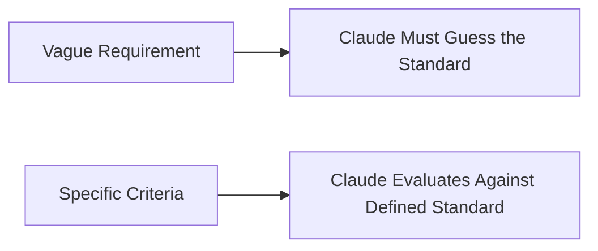

---

# 3. Criteria Should Be Testable

A useful rule is:

> If a human reviewer cannot consistently apply the criterion, Claude will also have difficulty applying it consistently.

Compare:

| Vague | Testable |
|---|---|
| "Bad security" | "Unsanitized external input reaches SQL execution" |
| "Poor code" | "Function can return an incorrect result for valid input" |
| "Bad error handling" | "Exception is swallowed without logging or recovery" |
| "Review carefully" | "Report every issue meeting the listed criteria" |

Specific criteria improve both prompting and evaluation.

---

# 4. Severity Levels

For review workflows, findings can be categorized by severity.

A project-specific rubric might define:

| Severity | Meaning | Example Action |
|---|---|---|
| **Critical** | High-impact issue requiring immediate action | Block release |
| **Major** | Important defect requiring correction | Fix before release |
| **Minor** | Lower-impact issue | Schedule or optionally fix |

> The exact severity taxonomy is application-defined. What matters is defining it consistently.

### Example

```text
Critical
→ Authentication bypass

Major
→ Missing error handling causing transaction failure

Minor
→ Low-impact inconsistency with no functional effect
```

---

# 5. False Positives and False Negatives

Reliable review systems need to understand two failure modes.

## False Positive

Claude reports a problem that is not actually a problem.

```text
Code is correct
      ↓
Claude flags it
      ↓
False Positive
```

Too many false positives create noise and reduce reviewer trust.

---

## False Negative

A real problem exists but Claude does not report it.

```text
Real defect exists
      ↓
Claude misses it
      ↓
False Negative
```

This is especially important when detecting high-impact defects.

---

# 6. Precision vs Recall

There is often a trade-off.

```text
Very strict reporting threshold
        ↓
Fewer false positives
        ↓
Potentially more missed findings


Broad reporting threshold
        ↓
More findings
        ↓
Potentially more false positives
```

One useful architecture is to separate **finding generation** from **filtering**.

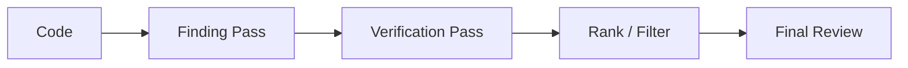

The first stage focuses on coverage.

The later stage verifies, ranks, and removes noise.

---

# 7. Attach Severity and Confidence to Findings

A review result can include both:

```text
Severity
+
Confidence
```

Example:

```json
{
  "issue": "User-controlled value reaches SQL query construction",
  "severity": "critical",
  "confidence": "high"
}
```

A useful routing approach:

```text
High Confidence
      ↓
Act / Prioritize


Medium Confidence
      ↓
Review


Low Confidence
      ↓
Additional Verification / Human Review
```

Confidence should be treated as **routing metadata**, not as a mathematically calibrated probability.

---

# 8. Example Finding Schema

```json
{
  "file": "src/database/orders.ts",
  "line": 82,
  "category": "security",
  "severity": "critical",
  "confidence": "high",
  "description": "User-controlled input is concatenated into the SQL query.",
  "recommendation": "Use a parameterized query."
}
```

The structured fields make later filtering and aggregation much easier.

---

# 9. Reduce Noisy Categories

If a category repeatedly produces unhelpful findings, do not simply make the whole prompt vague or conservative.

Instead, refine the criteria.

Example:

```text
Before:

Report security, correctness, performance,
maintainability, style, readability and architecture issues.
```

If style generates excessive noise:

```text
After:

Report security and correctness issues.

Ignore:
- naming preferences
- formatting
- subjective style suggestions
unless they create a functional defect.
```

This creates a clearer boundary.

---

# 10. Worked Review Example

Consider two prompts reviewing the same code.

## Prompt A

```text
Review this code.
```

Possible output:

```text
- Variable name could be improved.
- Function could be shorter.
- Consider adding comments.
- Error handling may be improved.
- Possible security concern.
```

The output contains substantial noise.

---

## Prompt B

```text
Review this code only for:

1. exploitable security vulnerabilities
2. logic defects that can change program behaviour
3. missing error handling that can cause a failed request

For every finding include:
- severity
- confidence
- evidence
- recommended correction

Do not report formatting, naming, comments, or stylistic preferences.
```

This produces a much more useful review contract.

---

# 11. Few-Shot Prompting

Examples are one of the strongest ways to teach Claude the desired pattern.

### Zero-Shot

Instructions only.

```text
Normalize this address.
```

### One-Shot

Instructions plus one example.

```text
Input:
221B Baker Street, London

Output:
221B Baker St, London
```

### Few-Shot

Instructions plus several representative examples.

```text
Example 1
Input → Output

Example 2
Input → Output

Example 3
Input → Output
```

Current Anthropic guidance recommends using relevant and diverse examples; **3–5 examples** is a useful general target.

---

# 12. Why Examples Work

Examples demonstrate:

- desired format
- decision boundaries
- terminology
- handling of edge cases
- what should not be invented

### Mental Model

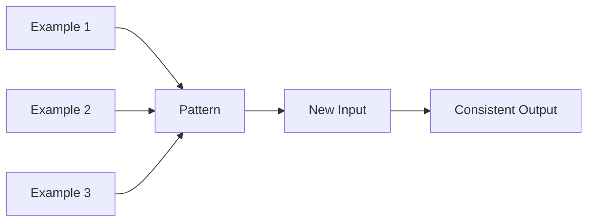

The goal is not for Claude to memorize examples.

The goal is for Claude to infer the **underlying pattern**.

---

# 13. Examples Should Include Edge Cases

Suppose the system extracts customer information.

Only showing complete examples may unintentionally teach:

```text
Every field must always contain a value.
```

Include an example where information is absent.

Example:

```text
Input:
Customer name: Rohit
Phone number: not provided

Output:
{
  "name": "Rohit",
  "phone": null
}
```

This teaches:

```text
Missing information
        ↓
Represent as missing
        ↓
Do not invent
```

---

# 14. Examples Should Be Diverse

Bad few-shot examples:

```text
Example 1 → nearly identical case
Example 2 → nearly identical case
Example 3 → nearly identical case
```

Claude may learn incidental patterns.

Better:

```text
Normal Case
Edge Case
Missing Data Case
Ambiguous Case
```

### Principle

> Demonstrate the rule, not merely one narrow sample.

---

# 15. Structured Outputs

Free-form text is flexible for humans.

It is often less suitable for automation.

Example:

```text
The claim appears to be an auto claim.
The amount is around ₹48,000.
The date is 12 September.
```

A downstream system now needs to parse prose.

Structured output is easier:

```json
{
  "claim_type": "auto",
  "amount": 48000,
  "date": "2026-09-12"
}
```

---

# 16. Current Structured Output Architecture

For final API responses, Claude supports JSON output constrained by JSON Schema.

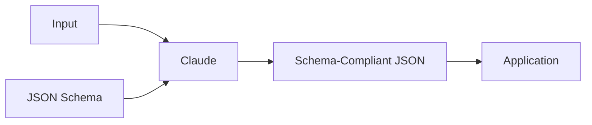

Conceptually:

```text
Input
+
Schema
    ↓
Claude
    ↓
Structured Response
```

---

# 17. JSON Schema as a Contract

The schema defines the expected shape.

Example:

```json
{
  "type": "object",
  "properties": {
    "claim_id": {
      "type": "string"
    },
    "amount": {
      "type": ["number", "null"]
    },
    "date": {
      "type": ["string", "null"]
    }
  },
  "required": [
    "claim_id",
    "amount",
    "date"
  ],
  "additionalProperties": false
}
```

The schema controls:

- field names
- field types
- required fields
- allowable structure

---

# 18. Required Does Not Mean Known

An important distinction:

```text
Required
≠
Information definitely exists
```

`required` means the output object must contain the field.

If the source may legitimately omit the value, a useful pattern is:

```json
{
  "amount": {
    "type": ["number", "null"]
  }
}
```

Then:

```json
{
  "amount": null
}
```

can honestly represent missing information.

### Better Contract

```text
Field must exist
+
Value may be null
```

instead of forcing Claude to generate a value that may not be supported by the source.

---

# 19. Nullable Fields

For extraction tasks:

```text
Source contains value
        ↓
Return value


Source does not contain value
        ↓
Return null
```

Example:

```json
{
  "claim_id": "CLM-1029",
  "phone": null
}
```

Prompt guidance should explicitly state:

> Do not infer or invent missing values. Use `null` where the schema allows it.

---

# 20. Enums for Controlled Classification

Enums are useful when the valid labels are known.

Example:

```json
{
  "claim_type": {
    "type": "string",
    "enum": [
      "auto",
      "home",
      "health",
      "other"
    ]
  }
}
```

Claude must choose from the provided categories.

---

# 21. The Escape-Hatch Pattern

Real-world data does not always fit predefined categories.

Without an escape hatch:

```text
Allowed:
auto
home
health

Input:
travel insurance claim
```

Claude may be forced toward the closest incorrect option.

A safer design:

```json
{
  "claim_type": {
    "type": "string",
    "enum": [
      "auto",
      "home",
      "health",
      "other"
    ]
  },
  "other_detail": {
    "type": ["string", "null"]
  }
}
```

Example result:

```json
{
  "claim_type": "other",
  "other_detail": "travel insurance"
}
```

### Principle

> A closed classification system should provide a controlled way to represent legitimate unknown cases.

---

# 22. Structured Output vs Tool Input

These solve related but different problems.

| Mechanism | Controls |
|---|---|
| **JSON Structured Output** | Claude's final response |
| **Strict Tool Use** | Parameters Claude sends to a tool |
| **`tool_choice`** | Whether / which tool Claude uses |

### Architecture

```text
Claude Final Response
        ↓
output_config.format
        ↓
JSON Schema


Claude → Tool
        ↓
strict: true
        ↓
Schema-Compliant Tool Arguments
```

Do not confuse the two.

---

# 23. `tool_choice`

Tool choice controls tool selection behaviour.

Conceptually:

| Mode | Behaviour |
|---|---|
| `auto` | Claude decides whether a tool is needed |
| `any` | Claude must use an available tool |
| specific tool | Claude must use the named tool |
| `none` | Tool use disabled |

Forcing a tool can guarantee that the relevant tool is selected.

It does **not** guarantee that the underlying business conclusion is correct.

---

# 24. Shape Correctness vs Meaning Correctness

A crucial distinction:

```text
Correct JSON Shape
        ≠
Correct Business Meaning
```

Example:

```json
{
  "claim_id": "CLM-1007",
  "amount": 5000
}
```

This is syntactically and structurally valid.

But the source document may actually state:

```text
₹4,800
```

The output is therefore structurally correct but semantically wrong.

---

# 25. Syntax vs Semantic Errors

## Syntax / Schema Error

Examples:

```text
Malformed JSON

Wrong datatype

Missing required property

Unexpected field
```

Structured Outputs are designed to prevent schema violations under normal completion.

---

## Semantic Error

The shape is valid but the information is wrong.

Example:

```json
{
  "total": 5000
}
```

when the source values actually sum to:

```text
4800
```

This requires business/application validation.

---

# 26. Validation Layer

A reliable architecture therefore separates:

```text
Structure Validation
+
Business Validation
```

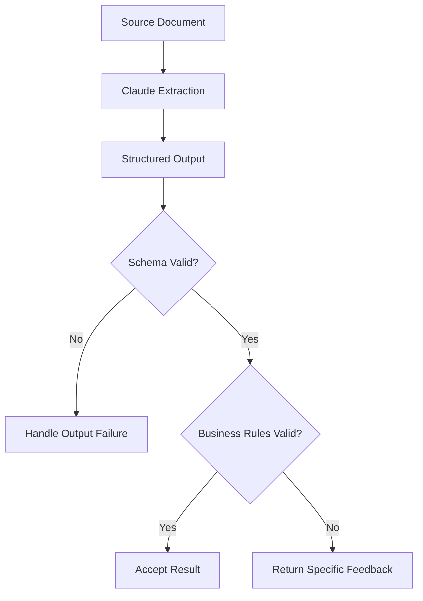

Examples of business validation:

```text
Line-item total == stated total?

Date exists in source?

Claim ID matches expected pattern?

Amount within valid range?

Category supported by source evidence?
```

---

# 27. Self-Correction With Feedback

When semantic validation fails, the system can return precise feedback.

Example:

```text
Your extracted total was ₹5,000.

The source contains:
₹1,200 + ₹1,600 + ₹2,000 = ₹4,800.

Re-check the line items and return the corrected structured result.
```

This creates a guided correction loop.

---

# 28. Self-Correction Loop

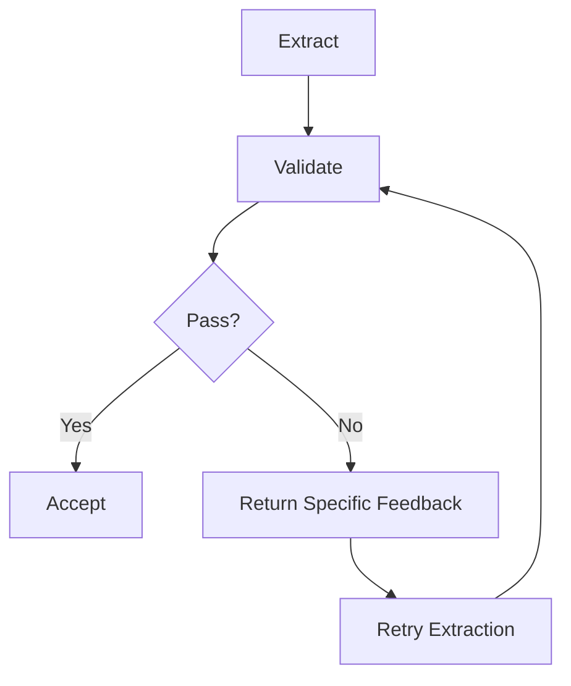

The workflow is:

```text
Extract
   ↓
Validate
   ↓
Give Specific Feedback
   ↓
Retry
   ↓
Revalidate
```

---

# 29. Retry Limits

Never allow an uncontrolled retry loop.

Example policy:

```text
Attempt 1
   ↓
Validation Failed

Attempt 2
   ↓
Validation Failed

Attempt 3
   ↓
Still Failed

Escalate
```

The exact retry count should be chosen for the application.

A useful architecture principle is:

```text
Retries must be bounded.
```

Possible escalation triggers include:

- maximum retry attempts reached
- low-confidence result
- conflicting source information
- repeated semantic validation failure

---

# 30. Retry With Better Feedback

Repeating the identical prompt is often less useful than explaining the failure.

Poor:

```text
Try again.
```

Better:

```text
The calculated total is incorrect.

Expected:
₹4,800

Your output:
₹5,000

Re-check only the line items and return the corrected result.
```

Now the retry has actionable information.

---

# 31. Reliable Extraction Architecture

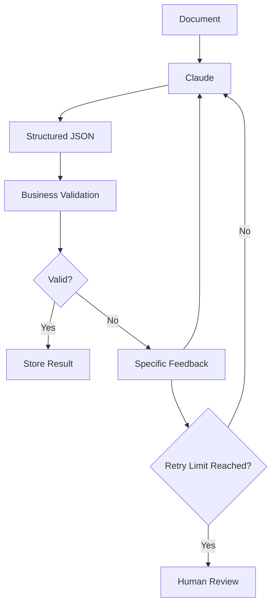

This is much more reliable than:

```text
Document
   ↓
Claude
   ↓
Trust Everything
```

---

# 32. Batch Processing

Some workloads do not require an immediate response.

Examples:

- monthly claim processing
- large-scale evaluation
- bulk document extraction
- offline review
- large dataset classification

For these cases, the Message Batches API can process many requests asynchronously.

---

# 33. Real-Time vs Batch

| Real-Time API | Message Batch |
|---|---|
| Immediate result expected | Result can arrive later |
| Interactive experience | Offline / background processing |
| Normal request pricing | 50% batch discount |
| Request handled immediately | Requests processed asynchronously |
| Good for user interaction | Good for large-volume processing |

### Rule

```text
Need answer now?
    ↓
Real-Time API


Can wait?
    ↓
Batch Processing
```

---

# 34. Batch Processing Limits

A Message Batch supports up to:

```text
100,000 requests
```

or:

```text
256 MB
```

whichever limit is reached first.

Batches can take up to:

```text
24 hours
```

to finish, although many complete significantly sooner.

This makes batches inappropriate for real-time user-facing workflows.

---

# 35. `custom_id`

Every request should have a unique identifier.

Example:

```text
claim-10001

claim-10002

claim-10003
```

Why?

Because batch results are not guaranteed to return in submission order.

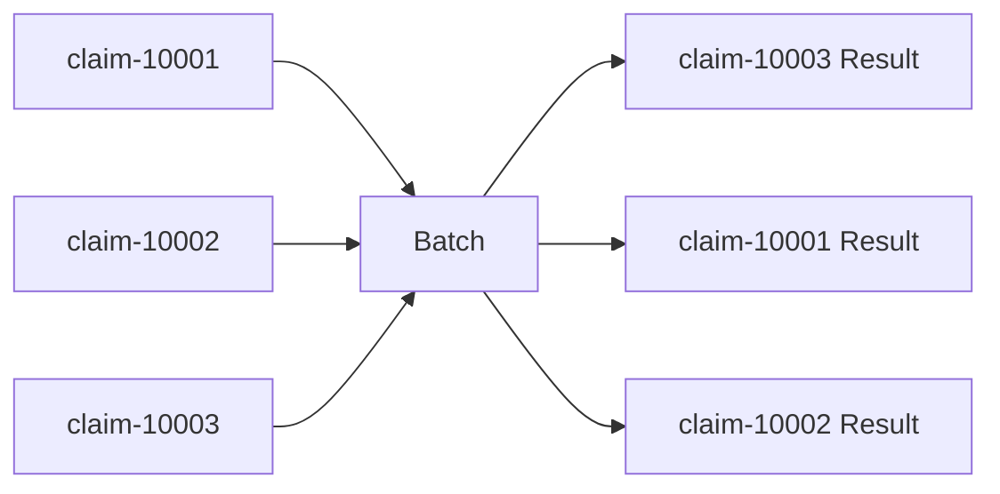

The `custom_id` lets the application correctly correlate every result with its original input.

---

# 36. Message Batch Workflow

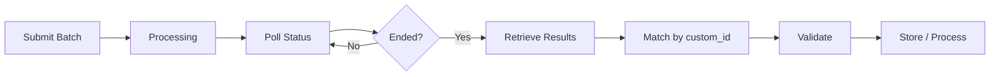

The core flow is:

```text
Submit
   ↓
Poll Status
   ↓
Retrieve Results
   ↓
Match by custom_id
   ↓
Validate
   ↓
Store
```

---

# 37. Batch Results

Results are provided in JSONL format.

Conceptually:

```json
{"custom_id":"claim-10001","result":{...}}
{"custom_id":"claim-10002","result":{...}}
{"custom_id":"claim-10003","result":{...}}
```

Always correlate results using:

```text
custom_id
```

rather than list position.

---

# 38. Batch Result Availability

Batch results remain available for retrieval for:

```text
29 days after batch creation
```

Applications that require long-term retention should retrieve and store the required results in their own system of record.

---

# 39. Real-World Scenario — Monthly Claims Processing

Suppose an organization processes:

```text
10,000 insurance claims every month
```

Immediate responses are unnecessary.

A suitable workflow is:

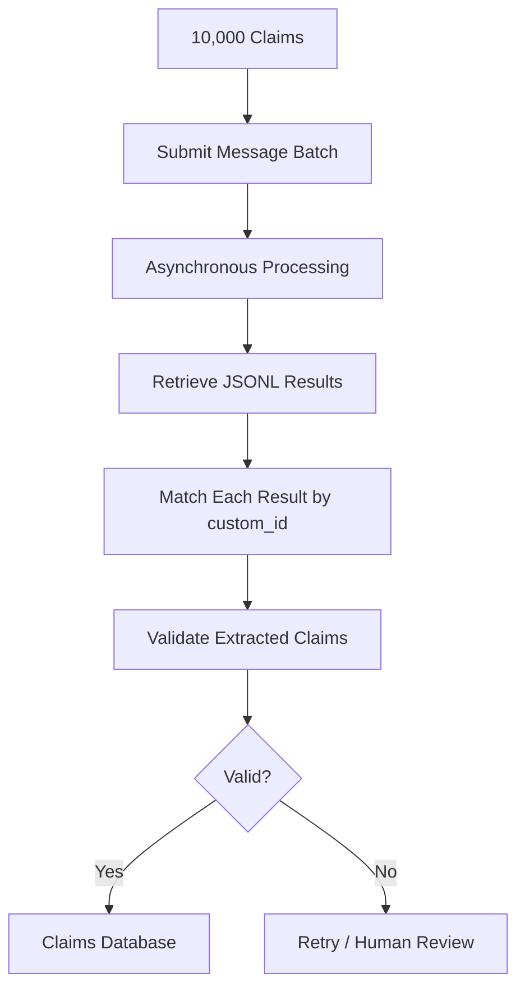

Possible IDs:

```text
claim-2026-10-00001
claim-2026-10-00002
claim-2026-10-00003
```

This provides reliable result correlation even if results arrive in a different order.

---

# 40. Multi-Pass Review

A single review pass is not always enough for complex code.

Why?

Potential problems include:

- limited attention over a large change
- one pass focusing on some categories more than others
- self-review bias
- local analysis missing integration defects

A multi-pass architecture can address these limitations.

---

# 41. Independent Review Passes

Instead of one general review:

```text
Review everything.
```

use independent passes.

Example:

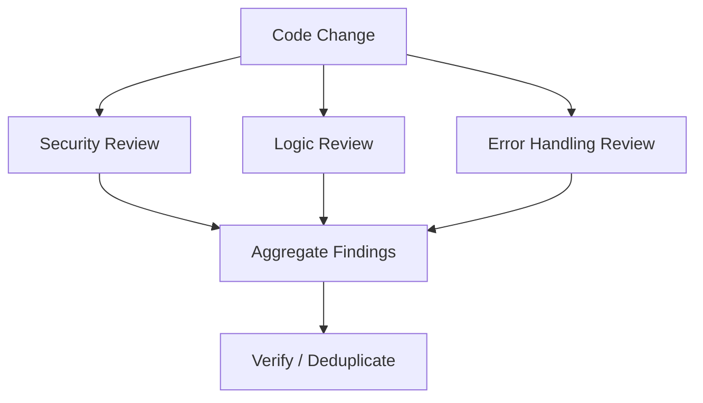

Each pass has a narrow responsibility.

---

# 42. Per-File Review

A per-file pass examines each changed file deeply.

```text
File A
→ Detailed Local Review

File B
→ Detailed Local Review

File C
→ Detailed Local Review
```

This is good for:

- local defects
- missing validation
- incorrect conditions
- resource handling
- file-specific security issues

---

# 43. Cross-File Review

A cross-file pass examines how components interact.

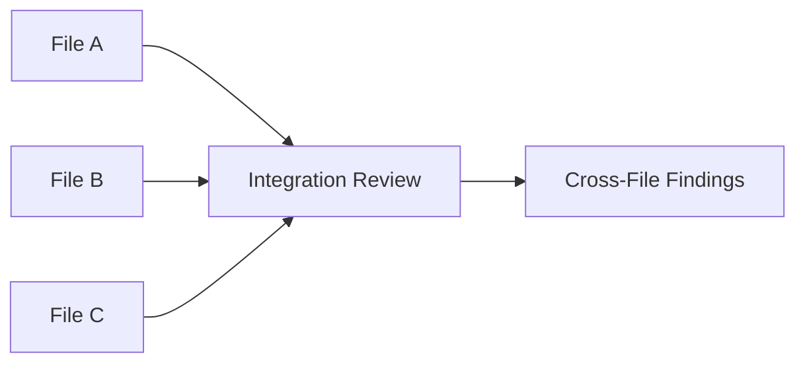

This can identify:

- mismatched interfaces
- inconsistent assumptions
- broken data flow
- integration errors
- changes that work individually but fail together

---

# 44. Per-File vs Cross-File

| Per-File Pass | Cross-File Pass |
|---|---|
| Deep local analysis | Integration analysis |
| Finds local bugs | Finds interaction bugs |
| Narrow context | Broader context |
| Good for implementation detail | Good for system behaviour |

For significant changes:

```text
Use Both
```

---

# 45. Independent Reviewer Pattern

A useful architecture is to run review in a context separate from implementation.

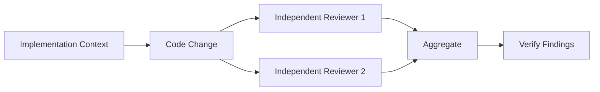

This reduces the risk of simply reinforcing the assumptions used to create the code.

---

# 46. Annotated Review Passes

Each reviewer can produce:

```text
Finding
+
Severity
+
Confidence
+
Evidence
```

Example:

```json
{
  "finding": "Authorization is checked after the data lookup rather than before access.",
  "severity": "major",
  "confidence": "high",
  "evidence": "src/api/customer.ts:84",
  "recommended_action": "Move authorization validation before retrieval."
}
```

---

# 47. Aggregating Multiple Review Passes

Multiple reviewers may identify the same issue.

The aggregation layer should:

```text
Collect
   ↓
Normalize
   ↓
Deduplicate
   ↓
Preserve Highest Relevant Severity
   ↓
Route by Confidence
   ↓
Produce Final Review
```

Architecture:

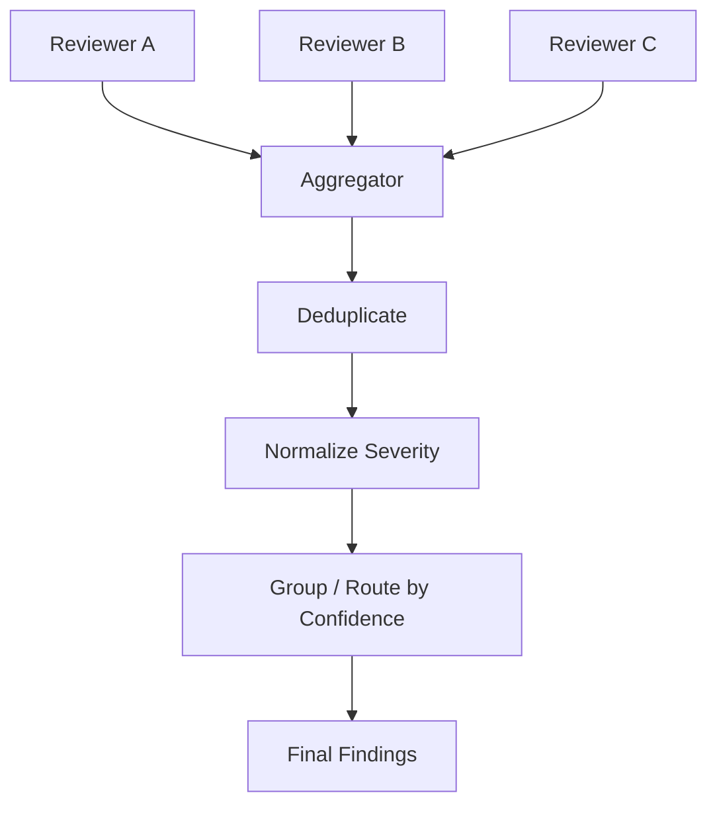

---

# 48. Complete Reliable Review Pipeline

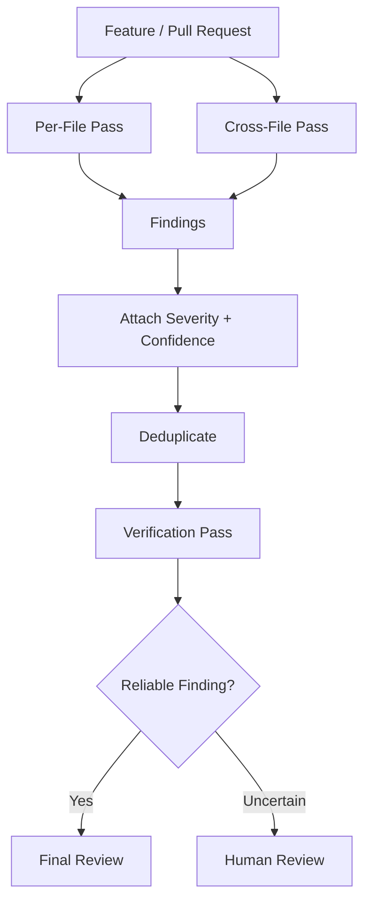

---

# 49. Prompt Engineering Reliability Loop

A good prompt is not usually designed once and never touched again.

The reliable process is:

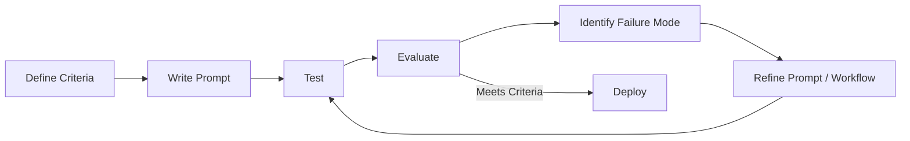

### Important Principle

> Improve prompts against defined evaluations rather than subjective impressions.

---

# 50. What Each Technique Solves

| Technique | Primary Problem Solved |
|---|---|
| Explicit criteria | Ambiguous expectations |
| Severity rubric | Inconsistent prioritization |
| Few-shot examples | Inconsistent patterns |
| Missing-data examples | Unsupported fabrication |
| Structured outputs | Output-shape inconsistency |
| Nullable fields | Legitimately missing values |
| Enums | Controlled classification |
| Escape hatch | Unknown valid categories |
| Business validation | Semantic mistakes |
| Retry with feedback | Correctable extraction errors |
| Retry limits | Infinite correction loops |
| Batch processing | High-volume offline workloads |
| `custom_id` | Out-of-order batch correlation |
| Per-file pass | Local defects |
| Cross-file pass | Integration defects |
| Independent review | Self-review bias |
| Confidence metadata | Routing / prioritization |

---

# 51. Domain Architecture Summary

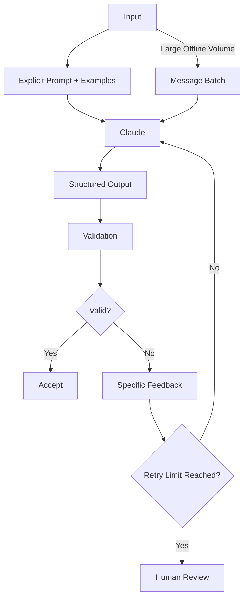

---

# 52. Quick Revision

| Concept | Remember |
|---|---|
| Explicit Criteria | Define exactly what success means |
| Vague Prompt | Forces Claude to infer the standard |
| Severity | Application-defined prioritization |
| False Positive | Reports something that is not actually wrong |
| False Negative | Misses a real issue |
| Few-Shot | Teach through multiple examples |
| Good Examples | Relevant + diverse + include edge cases |
| Structured Output | Constrain response to a defined schema |
| Required | Field must be present |
| Nullable | Field can explicitly contain `null` |
| Enum | Restrict classification values |
| Escape Hatch | `other` + supporting detail |
| Structured ≠ Correct | Shape can be valid while meaning is wrong |
| Schema Validation | Validate structure |
| Business Validation | Validate meaning |
| Retry With Feedback | Tell Claude exactly what failed |
| Retry Limit | Prevent infinite loops |
| Batch Processing | Large asynchronous workloads |
| Batch Pricing | 50% lower API pricing |
| Batch Limit | Up to 100,000 requests or 256 MB |
| Batch Time | Up to 24 hours |
| `custom_id` | Match results to requests |
| Batch Results | JSONL |
| Result Availability | 29 days after creation |
| Per-File Review | Deep local analysis |
| Cross-File Review | Integration analysis |
| Independent Review | Separate review context |
| Confidence | Useful routing metadata |
| Multi-Pass | Specialized reviews + aggregation |

---

# 53. Final Mental Model

```text
Define What Good Means
        ↓
Write Specific Instructions
        ↓
Provide Representative Examples
        ↓
Constrain the Output
        ↓
Validate the Meaning
        ↓
Give Specific Feedback
        ↓
Retry Within Limits
        ↓
Use Independent Review Where Needed
        ↓
Scale Offline Work With Batches
```

> **Domain 4 in one sentence:**  
> Reliable Claude workflows come from combining explicit success criteria, precise prompts, representative examples, structured output contracts, semantic validation, bounded correction loops, independent review, and the right execution model for the workload.
