# Domain 5 — Context Management, Reliability, Recovery & Provenance

Domain 5 focuses on keeping long-running Claude and multi-agent workflows **accurate, recoverable, grounded, and manageable as context grows**.

As an agent works across many turns, tools, documents, and subagents, the challenge is no longer only:

> Can Claude solve the task?

The architecture must also answer:

> Can the system preserve the right information, recover from failures, handle uncertainty, and explain where its conclusions came from?

The core mental model is:

```text
Long-Running Task
        ↓
Manage Context
        ↓
Preserve Important State
        ↓
Isolate Heavy Work
        ↓
Handle Failures Explicitly
        ↓
Resolve Ambiguity
        ↓
Track Confidence
        ↓
Preserve Provenance
        ↓
Escalate When Necessary
        ↓
Reliable Final Result
```

---

# 1. Context Is Working Memory

A model's context window is its working memory for the current interaction.

It can contain:

- system instructions
- conversation history
- documents
- tool definitions
- tool results
- images
- intermediate reasoning context
- current user instructions

As a long-running conversation grows, more information accumulates.

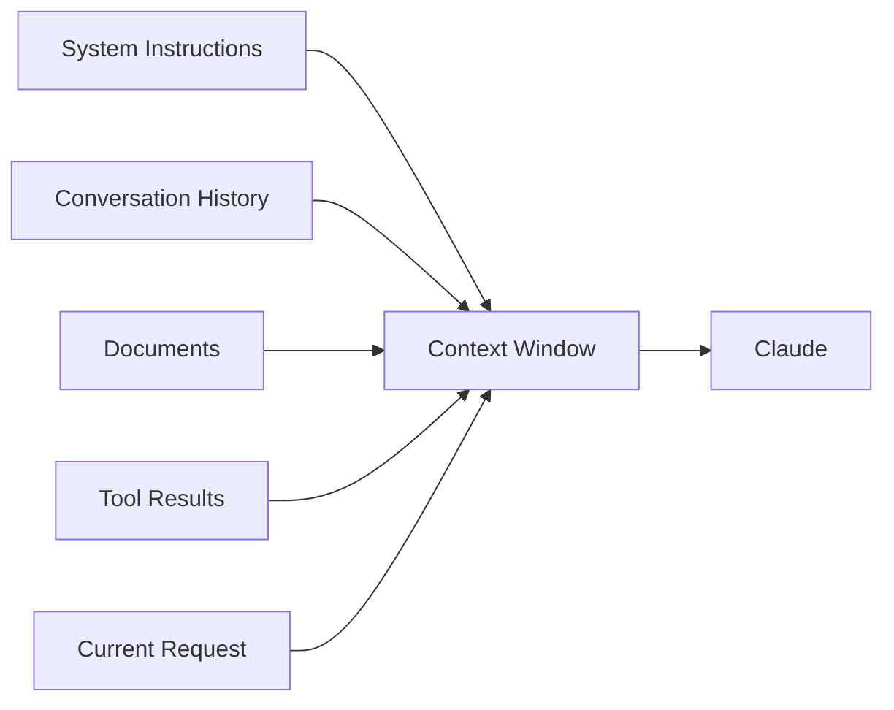

The important architectural principle is:

> More context is not automatically better context.

The objective is to preserve **relevant information**, not simply retain everything forever.

---

# 2. Why Long Context Can Degrade

A long session may contain:

```text
Important Decisions
Tool Results
Old Assumptions
Intermediate Attempts
Repeated Explanations
Debug Output
Completed Work
Irrelevant History
```

When all of this remains active, important facts can become harder to identify.

A useful mental model is:

```text
Useful Context
+
Accumulated Noise
+
Old Information
+
Large Tool Results
        ↓
Increasing Context Pressure
```

Potential consequences include:

- important instructions becoming less prominent
- relevant facts being buried
- old information being mistaken for current information
- unnecessary token consumption
- reduced efficiency in long-running agent workflows

---

# 3. Raw Tool Results Can Create Context Bloat

Tool calls often return much more information than the final task requires.

Example:

```text
Search Tool
    ↓
5,000-line result
    ↓
Only 5 findings matter
```

Keeping the complete raw result in active context for every later step may be unnecessary.

A better pattern is:

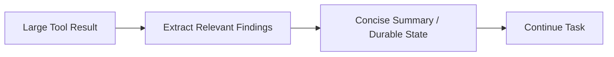

### Principle

> Preserve the information needed for future reasoning, not every intermediate byte.

---

# 4. Progressive Summarization

Long-running workflows benefit from periodically compressing completed work.

Instead of:

```text
Turn 1
Turn 2
Turn 3
Turn 4
Turn 5
...
Turn 80
```

continuing indefinitely in full detail, summarize resolved portions.

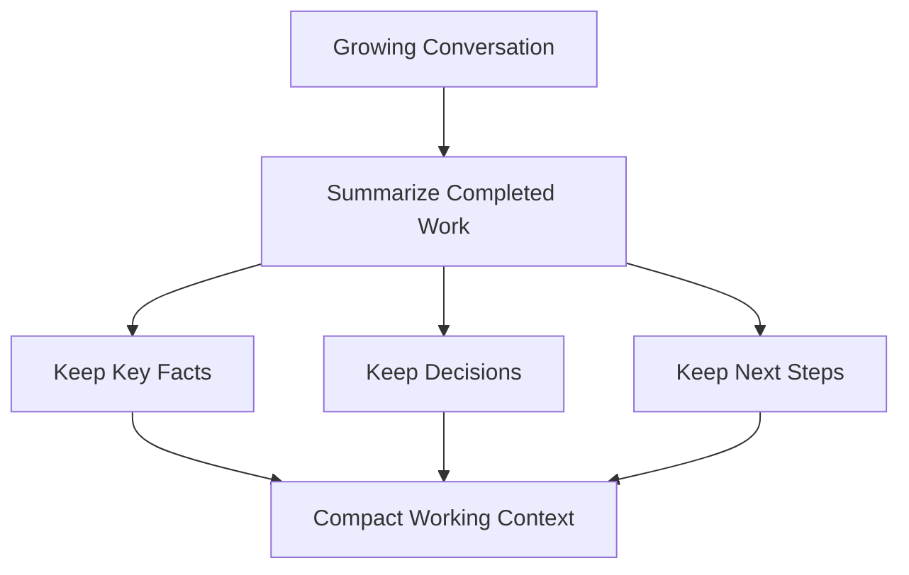

A useful summary should preserve:

```text
Goal
Current State
Important Facts
Decisions Already Made
Unresolved Questions
Next Actions
```

---

# 5. Claude Code `/compact`

Claude Code provides `/compact` for long conversations.

Conceptually:

```text
Large Conversation
        ↓
/compact
        ↓
Conversation Summary
        ↓
Continue With Freed Context
```

The purpose is not simply to delete history.

It is to preserve the important state in summarized form while freeing context capacity.

### Mental Model

```mermaid
flowchart LR
    H[Long History] --> C[/compact]
    C --> S[Summary]
    S --> N[Continue Conversation]
```

Claude Code can also compact automatically as context approaches its configured limit.

---

# 6. What a Good Compaction Should Preserve

For an engineering task, preserve:

```text
Objective

Architecture Decisions

Files Already Modified

Tests Completed

Known Failures

Important Constraints

Open Questions

Next Step
```

Avoid preserving unnecessary detail such as:

```text
Repeated explanations

Resolved debugging output

Large raw logs

Superseded hypotheses

Temporary exploration
```

---

# 7. Durable State Outside the Conversation

For long-running work, important state can also be written outside the conversation.

Example:

```text
progress.md
tests.json
findings.json
migration-state.md
```

Architecture:

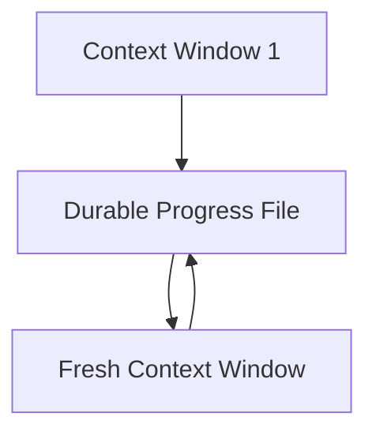

The new session can reconstruct its working state from durable artifacts rather than relying entirely on conversational memory.

### Example

```markdown
# Current Progress

## Completed
- Existing authentication flow reviewed
- Token validation path identified
- Integration tests documented

## Current Finding
Refresh tokens are validated in `token-service.ts`.

## Remaining
- Review session invalidation
- Update tests
- Verify logout flow
```

---

# 8. Extract and Persist Important Facts

A useful long-running-agent pattern is:

```text
Discover Fact
    ↓
Determine Whether It Matters Later
    ↓
Persist Important Fact
    ↓
Discard Unnecessary Detail
```

Example:

Raw result:

```text
4,000 lines of application logs
```

Persisted finding:

```text
Root cause:
Database connections reached the configured pool limit
between 14:03 and 14:17 UTC.
```

The concise finding is more useful in later reasoning than repeatedly carrying all 4,000 log lines.

---

# 9. Ambiguity Resolution

Agents should not confidently act when the request is genuinely ambiguous.

Example:

```text
Customer: Sharma
```

but the system finds:

```text
Order A → Customer Sharma
Order B → Customer Sharma
```

The wrong approach is:

```text
Choose one automatically
```

A safer approach is:

```text
Ask:
"Did you mean Order A or Order B?"
```

### Architecture

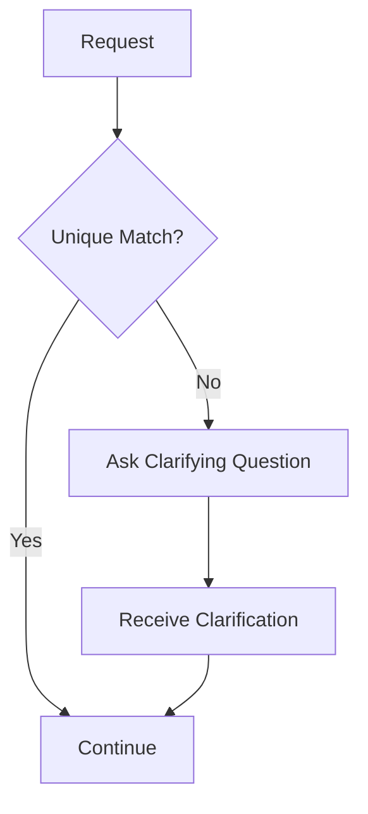

### Principle

> A confident wrong action can be worse than asking a short clarifying question.

---

# 10. When to Escalate

Escalation means deliberately stopping autonomous handling and requesting human involvement or additional clarification.

Common triggers from this domain include:

| Trigger | Reason |
|---|---|
| Low confidence | System is uncertain |
| High-stakes action | Error impact is significant |
| Policy gap | No defined rule covers the situation |
| Repeated failure | Automated recovery has failed |
| Conflicting evidence | Sources cannot be safely reconciled |
| Explicit human request | User asks to speak to a person |

Examples of high-impact areas include:

```text
Money
Safety
Identity
Legal / Compliance
Production-impacting actions
```

---

# 11. Explicit Human Request

If a user explicitly says:

```text
"I want to speak to a person."
```

the system should not continue repeatedly trying to solve the case automatically.

Conceptually:

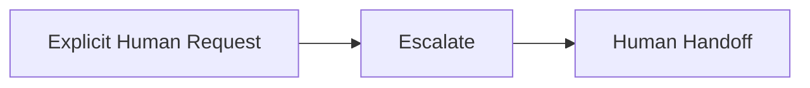

This prevents automation from becoming an obstacle.

---

# 12. Multi-Agent Failure Propagation

In a multi-agent architecture, a subagent may fail.

Example:

```text
Coordinator
     ↓
Research Subagent
     ↓
External Data Source
     ↓
Failure
```

The dangerous case is not always the failure itself.

The dangerous case is **silent failure**.

```text
Subagent returns nothing
        ↓
Coordinator cannot distinguish:
"No findings"
from
"Agent failed"
```

---

# 13. Structured Failure Hand-Back

Subagents should return an explicit outcome.

Conceptually:

```json
{
  "status": "failed",
  "failure_type": "access_failure",
  "retryable": true,
  "summary": "The external service timed out.",
  "partial_findings": []
}
```

Compare that with a valid empty result:

```json
{
  "status": "success",
  "result_count": 0,
  "summary": "Search completed successfully; no matching records were found."
}
```

These outcomes mean very different things.

---

# 14. Failure vs Empty Result

| Outcome | Meaning | Retry? |
|---|---|---|
| Access failure | System could not complete operation | Possibly |
| Timeout | Temporary infrastructure problem | Possibly |
| Permission denied | Access is not authorized | Usually no |
| Validation error | Input is incorrect | Correct input |
| Empty result | Operation succeeded, nothing matched | No |
| Partial result | Some work completed | Evaluate / continue |

### Key Principle

```text
No Result
≠
Failed Result
```

---

# 15. Recovery Strategies

Your notes identify three useful recovery patterns.

## Retry

Use when the failure is likely transient.

Examples:

```text
Temporary timeout
Rate limit
Short-lived network problem
```

---

## Skip and Record

If a non-critical part fails and the overall task can continue:

```text
Skip this component
        +
Record the gap
        +
Continue
```

Example:

```text
Three independent evidence sources:

Source A → Success
Source B → Temporarily unavailable
Source C → Success

Continue synthesis,
but explicitly report Source B as unavailable.
```

---

## Escalate

Use when:

```text
Failure is critical

Risk is high

Required information is unavailable

Retry limit has been reached
```

---

# 16. Recovery Decision Flow

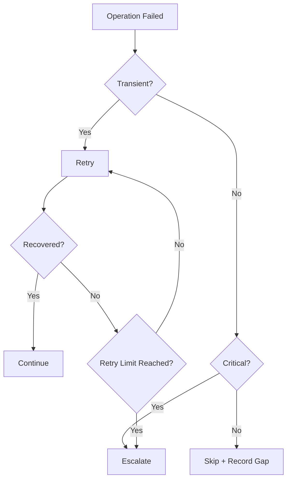

---

# 17. Bounded Retries

Do not create uncontrolled recovery loops.

Instead:

```text
Attempt 1
    ↓
Failed

Attempt 2
    ↓
Failed

Attempt 3
    ↓
Failed

Escalate / Record Failure
```

The exact retry limit belongs to the application design.

The important architectural rule is:

> Recovery must have a termination condition.

---

# 18. Recovery Manifest Pattern

For a long-running workflow, a durable recovery file can capture:

```text
What task was running?

What has completed?

What failed?

What remains?

What should happen next?
```

Example:

```json
{
  "task": "production-migration-review",
  "completed": [
    "inventory",
    "dependency-analysis"
  ],
  "failed": [
    {
      "step": "security-scan",
      "reason": "service timeout"
    }
  ],
  "next": "retry security scan, then generate final report"
}
```

This is an **architecture pattern**, not a special Claude Code file format.

Its purpose is to allow work to survive interruption without reconstructing everything from scratch.

---

# 19. Resuming Work

Claude Code supports continuing previous sessions, while durable project files can provide additional state for long-running tasks.

A useful recovery sequence is:

```text
Resume / Start Fresh
        ↓
Read Progress State
        ↓
Inspect Current Repository
        ↓
Verify What Is Already Complete
        ↓
Continue From Next Step
```

Do not assume old conversational state is still completely accurate.

Revalidate critical current state when appropriate.

---

# 20. Subagents for Context Isolation

A subagent runs with its own isolated context.

This is useful when a task requires significant exploration that the main conversation does not need to retain.

Example:

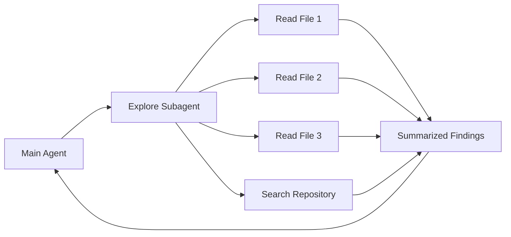

The heavy investigation happens outside the main conversation's context window.

Only the useful result returns.

---

# 21. Why Context Isolation Helps

Without isolation:

```text
Main Conversation

+ 30 Files

+ Search Output

+ Logs

+ Intermediate Notes

+ Final Findings
```

With a subagent:

```text
Subagent
    ↓
Reads 30 Files
    ↓
Performs Investigation
    ↓
Returns:

"These are the 5 important findings."
```

This keeps the parent context focused.

---

# 22. Subagent vs Main-Agent Work

| Main Agent | Subagent |
|---|---|
| Maintains task coordination | Performs focused delegated work |
| Needs overall context | Receives task-specific context |
| Preserves important decisions | Can absorb large exploratory context |
| Integrates conclusions | Returns summarized result |

Use subagents where the intermediate exploration does not need to remain in the main conversation.

---

# 23. Scratchpad / Durable Findings

Temporary or persistent files can hold working information outside the conversational context.

Example:

```text
research-notes.md
evidence.json
progress.md
unresolved-questions.md
```

A workflow might be:

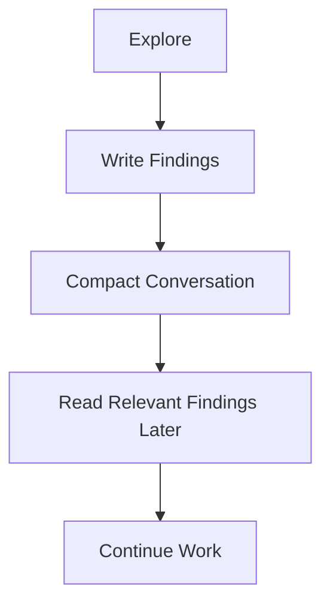

The file system can therefore act as durable task state across context transitions.

---

# 24. Human Review Should Be Selective

Sending every result to a person defeats much of the benefit of automation.

A better architecture routes uncertain or high-risk cases.

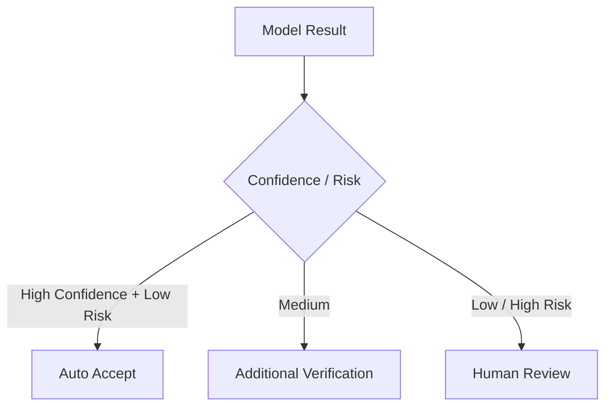

### Principle

> Review the cases that need human judgment rather than reviewing everything indiscriminately.

---

# 25. Field-Level Confidence

Confidence may vary within one document.

Example:

```json
{
  "claim_id": {
    "value": "CLM-1028",
    "confidence": "high"
  },
  "incident_date": {
    "value": "2026-09-14",
    "confidence": "medium"
  },
  "cause": {
    "value": "water damage",
    "confidence": "low"
  }
}
```

It is often more useful to identify uncertainty at the **field or claim level** than to assign one confidence label to the entire document.

---

# 26. Confidence Is Routing Metadata

A model-generated confidence label should not automatically be treated as a statistically calibrated probability.

For example:

```text
"90% confidence"
```

does not by itself prove:

```text
90% of similar predictions are correct.
```

Confidence is useful for:

- prioritization
- routing
- identifying uncertain fields
- deciding what should receive additional verification

Calibration requires measurement.

---

# 27. Confidence Calibration

To determine whether confidence levels are meaningful, compare predictions with known outcomes.

Example:

```text
Sample High-Confidence Results
        ↓
Measure Actual Accuracy

Sample Medium-Confidence Results
        ↓
Measure Actual Accuracy

Sample Low-Confidence Results
        ↓
Measure Actual Accuracy
```

A useful evaluation table:

| Confidence Group | Samples | Correct | Observed Accuracy |
|---|---:|---:|---:|
| High | 100 | 96 | 96% |
| Medium | 100 | 82 | 82% |
| Low | 100 | 57 | 57% |

The numbers above are illustrative.

The purpose is to test whether the confidence labels correspond to actual quality.

---

# 28. Stratified Sampling

Do not evaluate only random documents if important subgroups behave differently.

Sample across dimensions such as:

```text
Document Type

Field Type

Confidence Level

Data Quality

Source Type
```

Example:

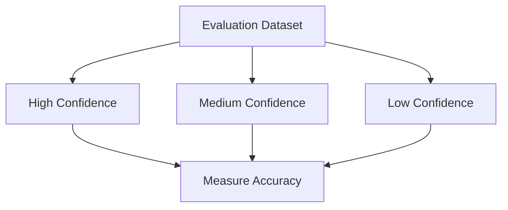

This helps identify situations where the model may be confidently wrong.

---

# 29. Track Accuracy by Field

Overall document accuracy can hide weak fields.

Example:

| Field | Accuracy |
|---|---:|
| Claim ID | 99% |
| Date | 96% |
| Amount | 94% |
| Root Cause | 78% |

If only document-level accuracy is measured, the weakness in `Root Cause` may not be obvious.

### Principle

> Measure the unit that matters operationally.

---

# 30. Provenance

Reliable synthesis should preserve **where each important claim came from**.

Example:

```json
{
  "claim": "The service outage began at 14:03 UTC.",
  "source": "monitoring-event-4281",
  "evidence": "Availability dropped below 10% at 14:03 UTC."
}
```

This allows the conclusion to be verified later.

---

# 31. Claim-to-Source Mapping

Instead of:

```text
Final Report
→ No idea which source supported each statement
```

prefer:

```text
Claim A
→ Source 2

Claim B
→ Source 1 + Source 3

Claim C
→ Source 4
```

Architecture:

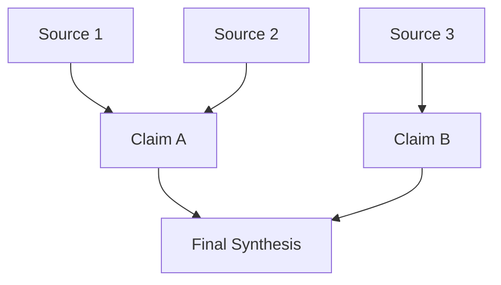

Anthropic's document-citation capabilities can provide exact supporting passages for document-grounded responses.

---

# 32. Multi-Source Synthesis

A synthesis workflow should not simply blend all sources into one undifferentiated answer.

A better process is:

```text
Read Sources
    ↓
Extract Claims
    ↓
Track Source for Each Claim
    ↓
Compare Claims
    ↓
Identify Agreement / Conflict
    ↓
Synthesize
```

---

# 33. Conflicting Sources

Suppose:

```text
Source A:
Estimated loss = ₹4.2M

Source B:
Estimated loss = ₹5.1M
```

Do not automatically produce:

```text
Estimated loss = ₹4.65M
```

unless averaging is explicitly meaningful to the domain.

Instead:

```text
Source A reports ₹4.2M.
Source B reports ₹5.1M.
The sources disagree.
```

### Principle

> Preserve disagreement when disagreement itself is important information.

---

# 34. Conflict-Aware Synthesis

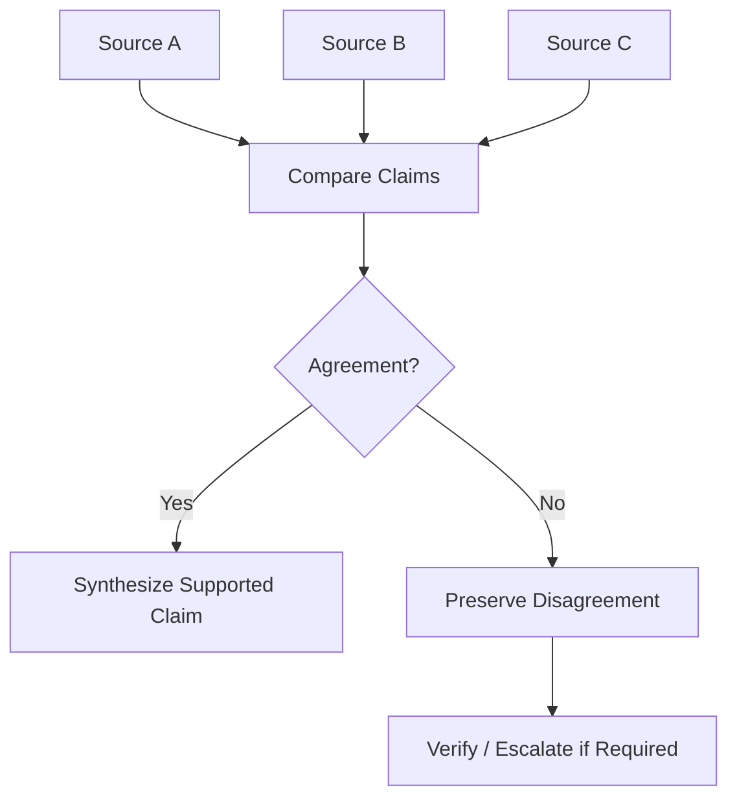

---

# 35. Temporal Reasoning

A fact is not always independent of time.

Example:

```text
2019:
Employee role = Engineer

2026:
Employee role = Principal Architect
```

These are not necessarily contradictory.

They may both be correct at different times.

Therefore a reliable record should sometimes preserve:

```text
Fact
+
Source
+
Effective Time
```

instead of storing only:

```text
Fact
```

---

# 36. Temporal Fact Model

Conceptually:

```json
{
  "claim": "Role is Principal Architect",
  "source": "employee-record-2026",
  "effective_date": "2026-06-01"
}
```

When later synthesizing:

```text
What was true?
+
When was it true?
+
Which source established it?
```

should all be considered.

---

# 37. Source + Time + Confidence

For high-value extracted facts, a richer record may look like:

```json
{
  "field": "incident_start",
  "value": "2026-10-05T14:03:00Z",
  "source": "monitoring-event-4281",
  "confidence": "high",
  "effective_time": "2026-10-05T14:03:00Z"
}
```

This supports:

- traceability
- verification
- temporal reasoning
- confidence-based routing

---

# 38. Real-World Scenario — Claims Processing

Consider a claim assembled from:

```text
Claim Form
Repair Invoice
Police Report
Customer Email
Adjuster Notes
```

The workflow could be:

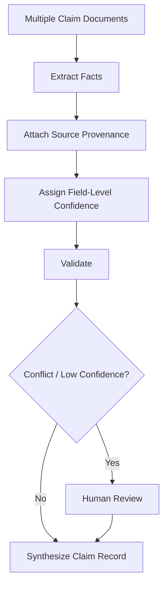

Example:

```text
Claim Amount
→ Invoice
→ High confidence

Accident Date
→ Claim Form + Police Report
→ High confidence

Cause of Damage
→ Customer statement only
→ Medium confidence
```

The entire document should not automatically receive one universal confidence score.

---

# 39. Real-World Scenario — Long-Running Engineering Investigation

Suppose Claude investigates an intermittent production outage.

The workflow may involve:

```text
Hundreds of log searches

Multiple configuration files

Monitoring queries

Infrastructure documentation

Several hypotheses
```

Instead of placing all exploration in the main conversation:

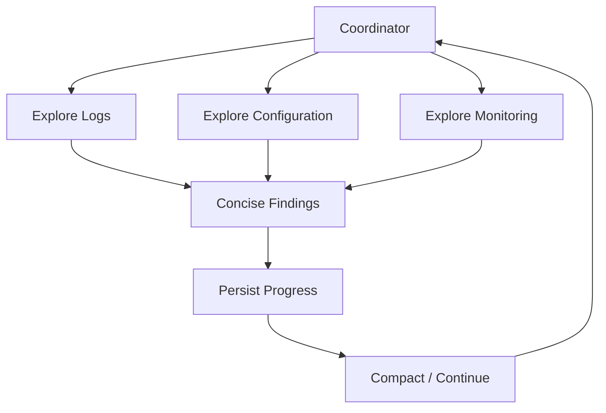

The final context retains:

```text
Current Hypothesis

Evidence

Rejected Hypotheses

Remaining Investigation

Next Step
```

rather than every raw search result.

---

# 40. Reliable Multi-Agent Architecture

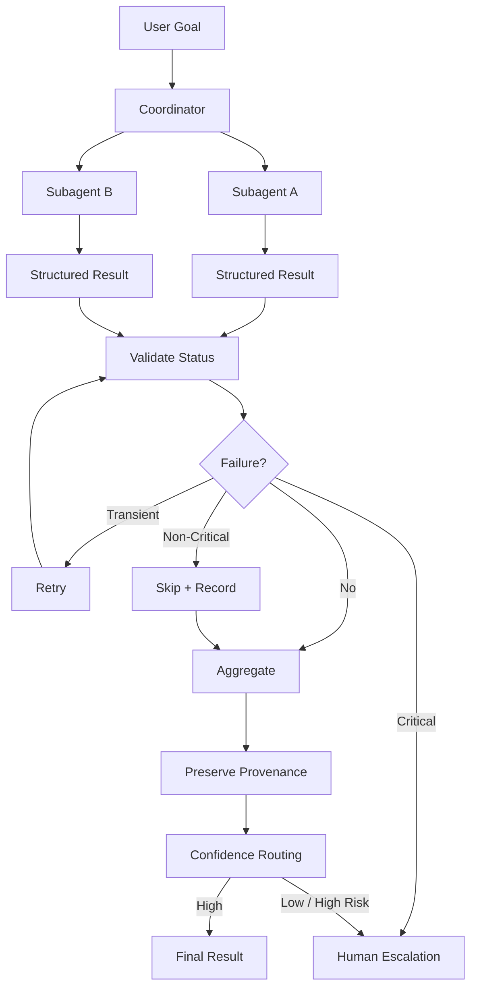

---

# 41. Context Management Architecture

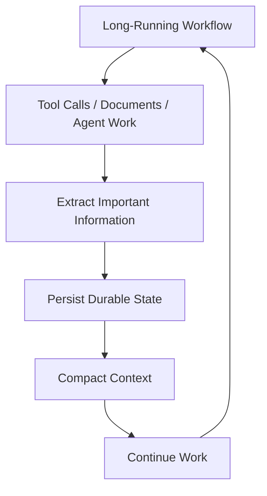

The design objective is:

```text
Preserve Meaning
while
Reducing Context Noise
```

---

# 42. What to Keep vs What to Compress

| Preserve | Usually Compress / Drop |
|---|---|
| User objective | Repeated explanation |
| Important constraints | Old raw tool output |
| Architecture decisions | Resolved debugging attempts |
| Validated facts | Superseded hypotheses |
| Source references | Repeated logs |
| Open risks | Completed intermediate chatter |
| Next actions | Irrelevant exploration |
| Critical failures | Duplicate findings |

---

# 43. Reliability Decision Matrix

| Situation | Recommended Response |
|---|---|
| Unique clear match | Continue |
| Multiple valid matches | Clarify |
| Temporary tool failure | Retry |
| Successful empty result | Accept as empty |
| Non-critical unavailable source | Skip + disclose |
| Critical source unavailable | Escalate |
| Low-confidence high-impact result | Human review |
| Conflicting evidence | Preserve conflict |
| Long conversation | Compact / persist state |
| Heavy exploratory task | Delegate to subagent |
| Context restart | Recover from durable state |
| Claim requiring verification | Preserve provenance / citation |

---

# 44. Quick Revision

| Concept | Remember |
|---|---|
| Context Window | Working memory for the current interaction |
| Context Rot | Accuracy/recall can degrade as context grows |
| Tool Context | Large tool definitions/results consume context |
| Progressive Summarization | Preserve meaning while removing noise |
| `/compact` | Summarize conversation and free context |
| Durable State | Persist important progress outside chat |
| Ambiguity | Clarify rather than guess |
| Escalation | Stop automation when risk/uncertainty demands it |
| Structured Failure | Explicitly return what failed and why |
| Empty Result | Successful operation with zero matches |
| Retry | Appropriate for transient failures |
| Skip + Record | Continue when failed part is non-critical |
| Subagent | Isolated context for focused work |
| Explore Work | Heavy investigation outside main context |
| Field-Level Confidence | Uncertainty may differ by field |
| Confidence | Routing signal, not automatically calibrated probability |
| Calibration | Compare confidence labels against real outcomes |
| Provenance | Preserve source behind each claim |
| Citations | Ground claims in exact source passages |
| Multi-Source Synthesis | Compare before combining |
| Conflict | Preserve disagreement when unresolved |
| Temporal Reasoning | Track when a fact was true |
| Recovery State | Preserve completed work + next step |

---

# 45. Final Mental Model

```text
Do Not Keep Everything
        ↓
Keep What Matters
        ↓
Persist Important State
        ↓
Isolate Heavy Exploration
        ↓
Compact When Context Grows
        ↓
Represent Failures Explicitly
        ↓
Retry Only When Appropriate
        ↓
Clarify Ambiguity
        ↓
Track Source + Confidence + Time
        ↓
Escalate High-Risk Uncertainty
        ↓
Produce a Grounded Result
```

> **Domain 5 in one sentence:**  
> Reliable long-running agentic systems actively manage context, preserve durable state, isolate expensive exploration, distinguish failures from valid empty results, maintain provenance and temporal meaning, and route uncertainty to the right recovery or human-review path.
